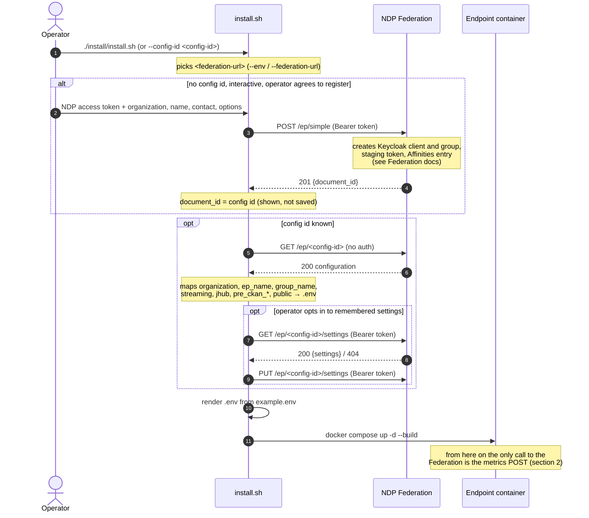
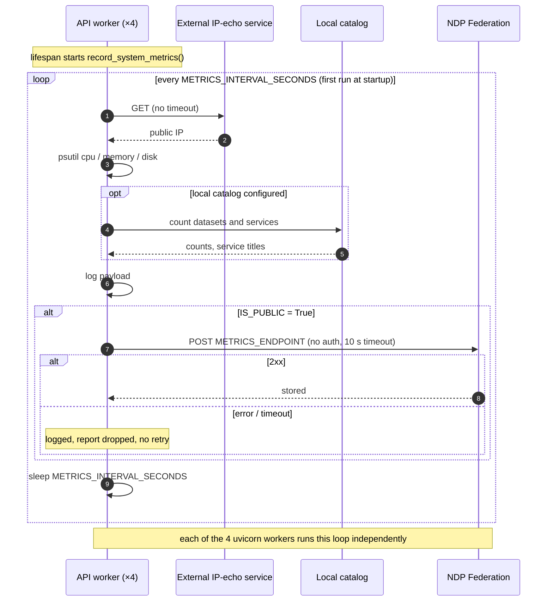

# Federation and metrics — the Endpoint side

How an NDP Endpoint (EP) registers with the NDP Federation, how it gets its
configuration back, and what it reports afterwards. This is the Endpoint half;
the Federation half — its data model, how it stores and uses what Endpoints
send — is documented in the `sci-ndp/ndp-federation` repository
(`docs/ARCHITECTURE.md`).

Everything here was read from the code at ep-api **v0.34.36** and checked
against a local NDP Federation **1.12.0**, the version running in production
and test when this was written (both report `1.12.0` on their public `/info`
and `/health/` routes). Statements that could not be confirmed from this side
are marked **Unverified**.

Placeholders: `<federation-url>` is the Federation base URL, `<config-id>` the
id a registration returns, `<token>` an NDP user access token.

- [At a glance](#at-a-glance)
- [1. Registration and configuration](#1-registration-and-configuration)
- [2. Metrics](#2-metrics)
- [3. Configuration variables](#3-configuration-variables)
- [4. Known gaps](#4-known-gaps)
- [5. Related documents](#5-related-documents)

## At a glance

| When | Who calls | Call | Auth sent | Code |
|---|---|---|---|---|
| Install, only when registering | `install.sh` | `POST <federation-url>/ep/simple` | `Authorization: Bearer <token>` (the operator's NDP token) | `register_with_federation`, `install/install.sh:471-736` |
| Install, whenever there is a config id | `install.sh` | `GET <federation-url>/ep/<config-id>` | none | `install/install.sh:1040-1144` |
| Install, optional, with a config id | `install.sh` | `GET` / `PUT <federation-url>/ep/<config-id>/settings` | `Authorization: Bearer <token>` | `install/install.sh:739-848` |
| Runtime, at startup and then every interval | the API | `POST <METRICS_ENDPOINT>` | none | `record_system_metrics`, `api/tasks/metrics_task.py:64-147` |

That is the whole contract. Once installed, **the running API never calls the
Federation except to post metrics**: a search of `api/` for the Federation URL,
`/ep/` and `config_id` finds only `metrics_task.py`, the setting itself
(`api/config/swagger_settings.py:18`) and `GET /status/`, which echoes it
(`api/services/status_services/check_api_status.py:100-102`). The word
"federation" elsewhere in `api/` refers to Pelican/OSDF, not to the NDP
Federation.

## 1. Registration and configuration

### 1.1 Which Federation

`install.sh` picks the Federation before doing anything else:

| Source | Value | Code |
|---|---|---|
| default | production Federation | `FEDERATION_URL_DEFAULT`, `install/install.sh:78` |
| `--env test` | test Federation (`<production>/test`) | `FEDERATION_URL_TEST`, `install/install.sh:79`, `264-269` |
| `--env prod` | production | `install/install.sh:264-269` |
| `--federation-url <url>` (or `--federation_url`) | that URL; wins over `--env` | `install/install.sh:230-235` |

The resolved URL is printed before anything is sent (`install/install.sh:279`).

It is used **only by the installer**. It is not written to `.env`: the metrics
target is the separate `METRICS_ENDPOINT` variable, which the installer never
sets (see [gap 4.1](#41-the-metrics-target-ignores-the-federation-chosen-at-install)).

### 1.2 Registering — `POST /ep/simple`

**When.** Only in an interactive run (a terminal and no `--yes`,
`interactive()` at `install/install.sh:306`), only when no `--config-id` was
given, and only if the operator answers yes to *Register this Endpoint with
the Federation now?* (`install/install.sh:955-964`). There is no unattended
way to register.

**Who.** The operator pastes their own NDP access token
(`install/install.sh:493`). The installer decodes the JWT locally, without
verifying it, to read `sub` as the `userid` (`install/install.sh:499-509`).

**Request** (`install/install.sh:596-636`; `curl -m 60`):

```http
POST <federation-url>/ep/simple
Authorization: Bearer <token>
Content-Type: application/json
```

| Field | Type | Value | Source |
|---|---|---|---|
| `organization` | string | prompt | `install/install.sh:515` |
| `ep_name` | string | prompt, default `my_endpoint` | `:520` |
| `poc` | string (email) | prompt, required | `:525-526` |
| `public` | bool | prompt, default yes | `:543` |
| `jhub` | bool | prompt | `:557` |
| `jupyter_url` | string | only when `jhub` is on and a URL was given | `:557-562`, `:625-626` |
| `streaming` | bool | prompt | `:567` |
| `rexec` | bool | prompt | `:572` |
| `userid` | string | `sub` from the operator's token | `:499-509` |
| `enable_staging` | bool | always `false` | `:551` |
| `ckan_name`, `ckan_password` | string | always `""` — required by the Federation's model, never used by it | `:528-536` |

**Response.** Only `document_id` is read; it becomes the **config id**
(`install/install.sh:722-730`). The operator is told to keep it
(`install/install.sh:734`); it is not saved anywhere on the machine (see
[gap 4.6](#46-the-endpoint-has-no-stable-identifier-of-its-own)).

| Status | Installer behaviour | Code |
|---|---|---|
| 201 | continue with the returned id | `:722-735` |
| 400 (interactive) | ask for another Endpoint name and retry — the name is taken | `:641-655` |
| 401 | stop: token not accepted | `:660-668` |
| 422 | stop, showing `message`/`detail`/`error` from the body | `:660-668` |
| 502 / 503 / 504 | stop, warning that a **partial registration may exist** and is not rolled back | `:692-714` |
| `000` | stop: Federation unreachable | `:660-668` |

What the Federation does with the request — create a Keycloak client
`ep-<config-id>` and group `ndp_ep/ep-<config-id>`, mint a staging-catalog
token, register in Affinities — is shown step by step in
[installing-registered-no-catalog.md](../sequence-diagrams/installing-registered-no-catalog.md)
and documented in the Federation repository. From this side the installer only
knows the contract above. Verified locally: a successful `POST /ep/simple`
returns `201 {"message": "Configuration saved", "document_id": "<config-id>"}`.

### 1.3 Bootstrapping from a config id — `GET /ep/{config_id}`

Runs whenever there is a config id: right after registering, or when the
operator passes `--config-id` (the platform's create-endpoint page hands them
exactly that command).

```http
GET <federation-url>/ep/<config-id>
```

No `Authorization` header is sent (`install/install.sh:1043-1044`, `curl -m
30`). The protection of this route is the Federation's concern and is covered
in its own documentation.

Before reading the response the installer turns every optional integration
off, so only what the registration asks for gets switched back on
(`install/install.sh:1030-1038`): `IS_PUBLIC`, `KAFKA_CONNECTION`,
`USE_JUPYTERLAB`, `S3_ENABLED`, `PELICAN_ENABLED`, `AFFINITIES_ENABLED`,
`REXEC_CONNECTION`, `PRE_CKAN_ENABLED`, `OIDC_ENABLED` are all set to `False`.

Response fields and what they become (`install/install.sh:1072-1140`):

| Response field | `.env` result | Code |
|---|---|---|
| `organization` | `ORGANIZATION` (if non-empty) | `:1088` |
| `ep_name` | `EP_NAME` (if non-empty) | `:1089` |
| `group_name` | `ENABLE_GROUP_BASED_ACCESS=True`, `GROUP_NAMES=<group_name>` (`ndp_ep/ep-<config-id>`) | `:1091-1094` |
| `streaming` | `KAFKA_CONNECTION=True/False`; adds the `kafka` compose profile | `:1096-1100`, `:1368-1371` |
| `jhub`, `jupyter_url` | `USE_JUPYTERLAB=True/False`, `JUPYTER_URL` | `:1102-1107` |
| `pre_ckan_url` + `pre_ckan_key` (both present) | `PRE_CKAN_ENABLED=True`, `PRE_CKAN_URL`, `PRE_CKAN_API_KEY`, `PRE_CKAN_ORGANIZATION=ep-<config-id>` | `:1117-1127` |
| `public` | `IS_PUBLIC=True/False` — this is what turns metrics on | `:1132` |
| `realm_name`, `client_id` | printed only, not written | `:1134-1140` |
| `rexec`, `poc`, `enable_staging`, `affinities_uid`, client secret | not read | — |

| Status | Installer behaviour | Code |
|---|---|---|
| 200 + JSON | apply the table above | `:1046-1054` |
| 404 | stop: configuration not found, check the id and `--federation-url` | `:1048` |
| `000` | stop: Federation unreachable | `:1049` |
| anything else, or a non-JSON body | stop | `:1050-1054` |

After rendering `.env`, the installer checks the staging token can write to
`ep-<config-id>` (`GET <PRE_CKAN_URL>/api/3/action/organization_list_for_user`,
`install/install.sh:1458-1480`) and only warns if it cannot.

Verified locally: running `install.sh --config-id <config-id>
--federation-url <local-federation> --dry-run --yes` against a local
Federation produced exactly the mapping above.

### 1.4 Remembered settings — `GET`/`PUT /ep/{config_id}/settings`

Optional, interactive only, and only with a config id
(`install/install.sh:887-889`). The operator is asked whether to keep their
answers in the Federation and, if yes, for their NDP token again
(`install/install.sh:762-770`).

```http
GET <federation-url>/ep/<config-id>/settings
Authorization: Bearer <token>

PUT <federation-url>/ep/<config-id>/settings
Authorization: Bearer <token>
Content-Type: application/json

{"settings": {"backend": "ckan", "want_s3": "no", ...}}
```

- Keys: `backend`, `want_s3`, `s3_endpoint`, `s3_secure`, `ep_api_port`,
  `auth_api_url`, `want_access_requests`, `mongodb_url`, `ckan_url`
  (`REMEMBERED_KEYS`, `install/remembered_settings.py:29-39`). Values are
  strings; credentials are deliberately excluded
  (`install/remembered_settings.py:24-28`).
- `GET`: 200 uses the body, 404 is treated as "nothing stored", 401/403 warn
  and drop the token (`install/install.sh:783-798`).
- `PUT` happens after every prompt is answered (`install/install.sh:1016`,
  `826-847`); 404 means the Federation does not offer the route yet.
- Neither failure stops the installation.

### 1.5 Registration sequence



## 2. Metrics

### 2.1 Trigger and conditions

- Started once per API process in the FastAPI lifespan:
  `asyncio.create_task(record_system_metrics())` (`api/main.py:113`),
  cancelled on shutdown (`api/main.py:115`).
- Loop (`api/tasks/metrics_task.py:71-147`): collect → post if allowed →
  `await asyncio.sleep(METRICS_INTERVAL_SECONDS)`. The **first report is sent
  at startup**, not after the first interval.
- Posted only when `IS_PUBLIC` is true and the payload is not empty
  (`api/tasks/metrics_task.py:129`). The code default of `IS_PUBLIC` is
  `True` (`api/config/swagger_settings.py:17`), but the installer always
  writes it explicitly: `False` without a registration, the registration's
  `public` flag with one (`install/install.sh:1030`, `1132`).
- Collection runs every interval **whether or not** the report is posted; it
  is always written to the log (`api/tasks/metrics_task.py:123`).
- Interval: `METRICS_INTERVAL_SECONDS`, default `3300` (55 minutes)
  (`api/config/swagger_settings.py:19`).
- **One loop per uvicorn worker.** The image runs `uvicorn --workers 4`
  (`Dockerfile.allinone:69`) and each worker runs the lifespan, so an Endpoint
  sends **four near-identical reports per interval**. Verified locally: four
  reports arrived at the Federation within the same second
  (see [gap 4.2](#42-four-reports-per-interval)).

### 2.2 Request

```http
POST <METRICS_ENDPOINT>
Content-Type: application/json
```

- A new `httpx.AsyncClient` per iteration; `timeout=10`;
  `raise_for_status()`, so any 2xx is success
  (`api/tasks/metrics_task.py:131-137`).
- **No authentication header** and no Endpoint credential of any kind.
- Target: `METRICS_ENDPOINT`, default `<production federation>/metrics/`
  (`api/config/swagger_settings.py:18`).

### 2.3 Payload

Built in `record_system_metrics` (`api/tasks/metrics_task.py:95-121`) and
`add_deployment_metrics` (`:31-61`). Types are as sent on the wire.

| Field | JSON type | Always? | Value | Source |
|---|---|---|---|---|
| `public_ip` | string | yes | the host's public IP — or, on failure, the text `"Error retrieving IP: …"` | `get_public_ip()`, `api/services/status_services/system_metrics.py:11-18` (calls an external IP-echo service) |
| `cpu` | string | yes | e.g. `"9.6%"` | `psutil.cpu_percent(interval=1)` |
| `memory` | string | yes | e.g. `"9.4GB/19.3GB"` (used/total) | psutil |
| `disk` | string | yes | e.g. `"121.3GB/456.9GB"` (used/total of `/`) | psutil |
| `version` | string | yes | ep-api version, e.g. `"0.34.36"` | `swagger_version`, `api/config/swagger_settings.py:15` |
| `organization` | string | yes | `ORGANIZATION` | `swagger_settings.py:20` |
| `ep_name` | string | yes | `EP_NAME` | `swagger_settings.py:21` |
| `num_datasets` | integer | yes | datasets in the local catalog; `0` without one | `api/tasks/metrics_task.py:82-91` |
| `num_services` | integer | yes | services in the local catalog; `0` without one | same |
| `services` | array of strings | yes | service titles; `[]` without a catalog | same |
| `timestamp` | string | yes | UTC ISO 8601 with `Z`, set by the Endpoint | `api/tasks/metrics_task.py:93` |
| `jupyterlab_enabled` | bool | yes | `USE_JUPYTERLAB` | `:108` |
| `kafka_enabled` | bool | yes | `KAFKA_CONNECTION` | `:109` |
| `s3_enabled` | bool | yes | `S3_ENABLED` | `:110` |
| `pre_ckan_enabled` | bool | yes | `PRE_CKAN_ENABLED` | `:111` |
| `ckan_api_key_configured` | bool | yes | a local CKAN key is set (never the key itself) | `:58-61` |
| `ckan_url` | string | if set | `CKAN_URL` | `:53-56` |
| `netbird_enabled` | bool | if any `NETBIRD_*` is set | `NETBIRD_ENABLED` | `:43-51` |
| `netbird_ip`, `netbird_group` | string | if set | `NETBIRD_IP`, `NETBIRD_GROUP` | same |
| `jupyterlab_url` | string | if JupyterLab is on | `JUPYTER_URL` | `:116-117` |
| `kafka_host` (string), `kafka_port` (integer) | | if Kafka is on | `KAFKA_HOST`, `KAFKA_PORT` | `:118-120` |

Example, as received by a local Federation (addresses replaced):

```json
{
  "public_ip": "203.0.113.10",
  "cpu": "9.6%",
  "memory": "9.4GB/19.3GB",
  "disk": "121.3GB/456.9GB",
  "version": "0.34.35",
  "organization": "ORGANIZATION-DEMO",
  "ep_name": "EP-DEMO",
  "num_datasets": 0,
  "num_services": 0,
  "services": [],
  "timestamp": "2026-10-07T14:51:16.568653Z",
  "jupyterlab_enabled": false,
  "kafka_enabled": false,
  "s3_enabled": false,
  "pre_ckan_enabled": false,
  "ckan_url": "https://<local-ckan>:8443",
  "ckan_api_key_configured": true
}
```

The Federation stores the body as received and adds `received_at`; see its
documentation for how it uses the report (including how it decides an
Endpoint is "alive").

### 2.4 Failure behaviour

| Situation | What happens | Code |
|---|---|---|
| Federation down, slow (>10 s) or non-2xx | logged with `logger.error`; **no retry** — the report is lost and the next attempt is a full interval later | `api/tasks/metrics_task.py:143-147` |
| Collecting fails before the payload is built | payload stays `{}`, nothing is posted | `:75-126`, `:129` |
| Collecting fails after the payload is built (e.g. in `add_deployment_metrics`) | the partial payload is still posted | same |
| The IP-echo service hangs | `requests.get` has **no timeout**, so collection — and the worker's event loop — waits | `system_metrics.py:14` |
| `IS_PUBLIC=False` | collected and logged, never posted | `:129` |

Collection is synchronous inside an async task: `psutil.cpu_percent(interval=1)`
blocks for a second, and the IP lookup and catalog counts are blocking calls,
so the worker cannot serve requests while they run.

### 2.5 Metrics sequence



## 3. Configuration variables

Variables that affect registration, configuration bootstrap or metrics. Full
reference: [configuration.md](../configuration.md).

| Variable | Default in code | Default in `example.env` | Set by the installer | Effect |
|---|---|---|---|---|
| `IS_PUBLIC` | `True` (`swagger_settings.py:17`) | `True` | yes: `False`, or the registration's `public` | gates the metrics POST |
| `METRICS_ENDPOINT` | production Federation `/metrics/` (`:18`) | same | **no** | where metrics are posted |
| `METRICS_INTERVAL_SECONDS` | `3300` (`:19`) | `3300` | no | seconds between reports |
| `ORGANIZATION` | `Unknown Organization` (`:20`) | `ORGANIZATION-DEMO` | prompt or registration | sent in every report; Federation groups by it |
| `EP_NAME` | `Unknown EP` (`:21`) | `EP-DEMO` | prompt or registration | sent in every report; Federation groups by it |
| `NETBIRD_ENABLED`, `NETBIRD_IP`, `NETBIRD_GROUP` | unset (read with `os.getenv`, `metrics_task.py:43-45`) | `False`, empty | no | optional report fields |
| `CKAN_URL`, `CKAN_API_KEY` | `ckan_settings.py:10-11` | empty | when a local CKAN is installed or given | `ckan_url`, `ckan_api_key_configured` in the report |
| `USE_JUPYTERLAB`, `JUPYTER_URL` | `False` (`swagger_settings.py:22-23`) | `True`, local URL | from the registration's `jhub` | report flag and URL |
| `KAFKA_CONNECTION`, `KAFKA_HOST`, `KAFKA_PORT` | `False` (`kafka_settings.py:8-10`) | `True`, `kafka`, `9093` | from the registration's `streaming` | report flag, host, port |
| `S3_ENABLED` | `False` (`minio_settings.py:7`) | `True` | from the S3 prompt | report flag |
| `PRE_CKAN_ENABLED`, `PRE_CKAN_URL`, `PRE_CKAN_API_KEY`, `PRE_CKAN_ORGANIZATION` | `ckan_settings.py:14-18` | `False`, empty | from the registration (`pre_ckan_url`, `pre_ckan_key`, `ep-<config-id>`) | staging catalog; report flag |
| `ENABLE_GROUP_BASED_ACCESS`, `GROUP_NAMES` | `False`, empty (`swagger_settings.py:26-27`) | `False`, empty | from the registration's `group_name` | who may use the Endpoint |
| `AFFINITIES_ENABLED`, `AFFINITIES_URL`, `AFFINITIES_EP_UUID` | `False`, empty (`affinities_settings.py:30-33`) | `False`, empty | always `AFFINITIES_ENABLED=False`; UUID never set | Affinities registration of datasets/services; also used for roles and access requests |

Installer-only switches (not in `.env`): `--federation-url`, `--env prod|test`,
`--config-id` (`install/install.sh:78-89`, `230-235`).

## 4. Known gaps

Each verified against the code; those marked *live* were also reproduced
against a local Endpoint and Federation.

### 4.1 The metrics target ignores the Federation chosen at install

`--env test` or `--federation-url` decide where the installer registers and
fetches the configuration, but `METRICS_ENDPOINT` is never written, so the
Endpoint keeps posting to the production default
(`api/config/swagger_settings.py:18`, `example.env:35`). *Live:* an install
bootstrapped from a local Federation rendered `METRICS_ENDPOINT=<production
federation>/metrics/`. An Endpoint registered against the test Federation
therefore reports to production.

### 4.2 Four reports per interval

`--workers 4` (`Dockerfile.allinone:69`) runs four independent metrics loops.
*Live:* four reports with the same `organization`/`ep_name` reached the
Federation within the same second, every interval. Anything counting reports
or computing uptime from them is off by a factor of four. The same
duplication applies to the startup work in the lifespan (`api/main.py:64-115`).

### 4.3 No schema version

The payload carries the ep-api `version`, but nothing identifies the shape of
the report itself. The fields have changed across releases (NetBird and CKAN
fields were added later), and the receiver cannot tell which contract a report
follows.

### 4.4 Measurements sent as formatted strings

`cpu`, `memory` and `disk` are display strings with units (`"9.6%"`,
`"9.4GB/19.3GB"`), not numbers (`api/tasks/metrics_task.py:97-99`), so the
Federation cannot aggregate, compare or alert on them without parsing. The
counts (`num_datasets`, `num_services`) are integers. `public_ip` can also be
an error message instead of an address (`system_metrics.py:17-18`).

### 4.5 No retry, no buffering

A report that fails is dropped; the next one comes a full interval (55
minutes by default) later (`api/tasks/metrics_task.py:143-147`). A Federation
outage of a few minutes can make an Endpoint look absent for an hour.

### 4.6 The Endpoint has no stable identifier of its own

- Reports identify the Endpoint only by `organization` + `ep_name` (+
  `public_ip`), which the operator can change by editing `.env`.
- The config id is not stored on the machine: it appears only embedded in
  `GROUP_NAMES` (`ndp_ep/ep-<config-id>`) and `PRE_CKAN_ORGANIZATION`
  (`ep-<config-id>`); `.env.install-state` keeps only CKAN values
  (`install/install.sh:1307-1310`).
- The Affinities uid the registration creates is ignored and
  `AFFINITIES_EP_UUID` stays empty (`install/install.sh:1035`). Besides
  Affinities, that variable drives Endpoint-specific roles and access-request
  approval, which answers 503 without it
  (`api/services/access_request_services/access_request_service.py:63-70`).

### 4.7 Reports are not authenticated

The POST carries no credential (`api/tasks/metrics_task.py:131-136`). The
Federation cannot tell a report from the Endpoint apart from one sent by
anyone who knows its organization and name. How the Federation handles this is
covered in its own documentation.

### 4.8 Blocking collection

`requests.get` to the IP-echo service has no timeout
(`system_metrics.py:14`), and collection blocks the event loop (2.4). The
public IP is also looked up on every interval even when `IS_PUBLIC=False`.

### 4.9 Silent placeholders from a partial registration

If the Federation cannot reach Keycloak or the staging catalog during
`POST /ep/simple`, it still answers 201 and stores placeholder credentials.
*Live:* with those services unreachable, the registration returned 201 and the
installer then rendered `PRE_CKAN_ENABLED=True` with a placeholder
`PRE_CKAN_API_KEY`; the only signal is the post-render staging check, which
warns and continues (`install/install.sh:1458-1480`).

### 4.10 Settings the registration asks for but the Endpoint loses

- `rexec`: the Federation stores the flag but not the URL; the URL is applied
  only during the run that registered (`install/install.sh:120-122`,
  `1112-1115`), so re-running with `--config-id` loses remote execution.
- `realm_name` and `client_id` are printed, not stored
  (`install/install.sh:1134-1140`).
- **Unverified** from this side: after remembered settings are loaded, most
  prompts still offer their hard-coded defaults rather than the remembered
  value (`install/install.sh:902-1011`); only the port is seeded from it.

### 4.11 Documentation that no longer matches

- [05-for-institutional-admins.md](../info_for_nationaldataplatform/05-for-institutional-admins.md)
  describes the earlier, manual onboarding:
  - the NDP team registers the Endpoint and hands back an `EP_UUID` and staging
    tokens — the installer now self-registers through `POST /ep/simple`, and
    `AFFINITIES_EP_UUID` is never set;
  - the operator writes `.env` — the installer renders it;
  - updates come with `docker compose pull` — the compose file builds the API
    image locally (`up -d --build`, `install/install.sh:1521`);
  - metrics are retried when the Federation is unreachable — they are not
    (4.5);
  - only metadata and flags are sent — the report also carries the public IP,
    CKAN URL, Kafka host/port, JupyterLab URL and NetBird address;
  - an encryption key for a store lives in `.env` — no such variable exists.
- [installing-registered-no-catalog.md](../sequence-diagrams/installing-registered-no-catalog.md):
  omits the S3 and access-request prompts and `PRE_CKAN_ORGANIZATION`; shows
  "201 Created" for metrics where any 2xx is accepted and only one report per
  interval where four are sent; its `.env` value count no longer matches.
- [installing-standalone-no-catalog.md](../sequence-diagrams/installing-standalone-no-catalog.md):
  shows an identity-provider sign-in prompt that no longer exists
  (`OIDC_ENABLED` is forced off, `install/install.sh:1038`) and omits the S3
  and access-request prompts.
- `README.md` "System Metrics" shows an old payload (`"version": "0.3.2"`),
  lists fields that are not sent, and does not say posting depends on
  `IS_PUBLIC`.

## 5. Related documents

- [connector-nodes-ep-inventory.md](connector-nodes-ep-inventory.md) — the
  Endpoint's components and their reuse in a connector node.
- [Installing an Endpoint registered with the Federation](../sequence-diagrams/installing-registered-no-catalog.md)
  — the same registration including what the Federation does with Keycloak,
  the staging catalog and Affinities.
- [configuration.md](../configuration.md) — every environment variable.
- [install/README.md](../../install/README.md) — installer options.
- `sci-ndp/ndp-federation`: `docs/ARCHITECTURE.md` — the Federation side.
