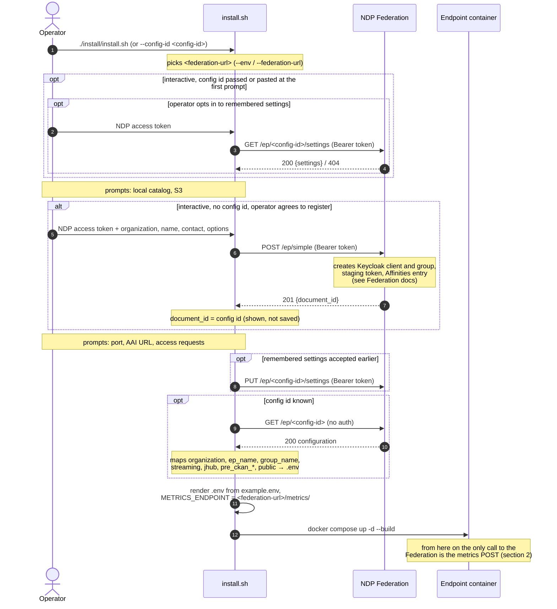
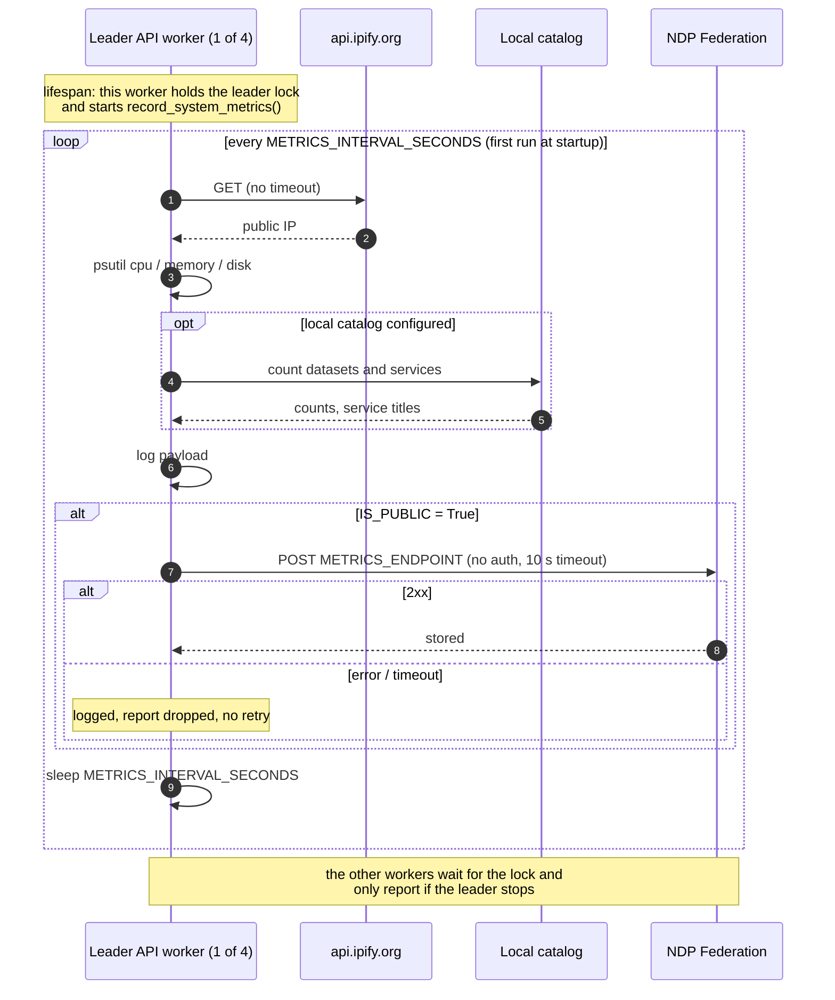

# Federation and metrics — the Endpoint side

How an NDP Endpoint (EP) registers with the NDP Federation, how it gets its
configuration back, and what it reports afterwards. This is the Endpoint half;
the Federation half — its data model, how it stores and uses what Endpoints
send — is documented in the `sci-ndp/ndp-federation` repository
(`docs/ARCHITECTURE.md`).

Everything here was read from the code at ep-api **v0.34.46**. The Federation's
side of each call was checked against a local NDP Federation **1.12.0**, the
version running in production and test when this was first written. The
Federation releases since then (1.12.1 to 1.12.6: 404 instead of 500 for an
unknown id on `PUT`/`DELETE`, `/info` and Swagger naming the `Admin-Password`
header, `MONGO_USERNAME`/`MONGO_PASSWORD` taking effect, a working
`.env.example`, a working metrics date filter, health and readiness detecting
an unusable database) do not change any of the calls described here.
Statements that could not be confirmed from this side are marked
**Unverified**.

**Summary**

- At install time the installer can register the Endpoint (`POST /ep/simple`
  with the operator's NDP token) and then bootstraps it from the returned
  config id (`GET /ep/{id}`), mapping the configuration into `.env`. It also
  writes `METRICS_ENDPOINT` for the Federation it was pointed at.
- At runtime the Endpoint's only call to the Federation is a metrics report:
  at startup and every 55 minutes, one per interval, only when `IS_PUBLIC` is
  true, without authentication, without retries.
- Main gaps (§4): reports carry no stable Endpoint identifier and no schema
  version, measurements are strings, a failed report is not retried, and
  reports are not authenticated.

Placeholders: `<federation-url>` is the Federation base URL, `<config-id>` the
id a registration returns, `<token>` an NDP user access token.

- [At a glance](#at-a-glance)
- [1. Registration and configuration](#1-registration-and-configuration)
- [2. Metrics](#2-metrics)
- [3. Configuration variables](#3-configuration-variables)
- [4. Known gaps](#4-known-gaps)
- [5. Related documents](#5-related-documents)

## At a glance

| When | Who calls | Call | Auth sent | Code |
|---|---|---|---|---|
| Install, interactive, optional, only with a config id passed or pasted at the first prompt | `install.sh` | `GET` / `PUT <federation-url>/ep/<config-id>/settings` | `Authorization: Bearer <token>` | `install/install.sh:742-852`, called at `:891-893` and `:1020` |
| Install, only when registering | `install.sh` | `POST <federation-url>/ep/simple` | `Authorization: Bearer <token>` (the operator's NDP token) | `register_with_federation`, `install/install.sh:475-740` |
| Install, whenever there is a config id | `install.sh` | `GET <federation-url>/ep/<config-id>` | none | `install/install.sh:1044-1148` |
| Runtime, at startup and then every interval, from one worker | the API | `POST <METRICS_ENDPOINT>` | none | `record_system_metrics`, `api/tasks/metrics_task.py:64-147`; started in `api/main.py:98-134` |

The rows are in the order they happen in an interactive run (§1.5).

That is the whole contract. Once installed, **the running API never calls the
Federation except to post metrics**: a search of `api/` for the Federation URL,
`/ep/` and `config_id` finds only `metrics_task.py`, the setting itself
(`api/config/swagger_settings.py:18`) and `GET /status/`, which echoes it
(`api/services/status_services/check_api_status.py:100-102`). The word
"federation" elsewhere in `api/` refers to Pelican/OSDF or, in one comment, to
the platform as a whole — never to calls to the NDP Federation.

## 1. Registration and configuration

### 1.1 Which Federation

`install.sh` picks the Federation before doing anything else:

| Source | Value | Code |
|---|---|---|
| default | production Federation | `FEDERATION_URL_DEFAULT`, `install/install.sh:78` |
| `--env test` | test Federation (`<production>/test`) | `FEDERATION_URL_TEST`, `install/install.sh:79`, `264-269` |
| `--env prod` | production | `install/install.sh:264-269` |
| `--federation-url <url>` (or `--federation_url`) | that URL; wins over `--env` | `install/install.sh:232-234`, `264-269` |

The resolved URL is printed before anything is sent (`install/install.sh:279`).

The installer uses it for every call in §1, and since 0.34.37 also writes it
to `.env` as `METRICS_ENDPOINT=<federation-url>/metrics/`
(`install/install.sh:1150-1156`). That line runs on every install, with or
without a registration; without one `IS_PUBLIC` is `False` and nothing is
posted (§2.1).

### 1.2 Registering — `POST /ep/simple`

**When.** Only in an interactive run (a terminal and no `--yes`,
`interactive()` at `install/install.sh:306`), only when no config id was given
with `--config-id` or pasted at the first prompt (`install/install.sh:876-886`,
`959`), and only if the operator answers yes to *Register this Endpoint with
the Federation now?* (default yes, `install/install.sh:960-968`). There is no
unattended way to register.

**Who.** The operator pastes their own NDP access token
(`install/install.sh:497`). The installer decodes the JWT locally, without
verifying it, to read `sub` as the `userid` (`install/install.sh:503-513`).

**Request** (`install/install.sh:599-640`; `curl -m 60`):

```http
POST <federation-url>/ep/simple
Authorization: Bearer <token>
Content-Type: application/json
```

| Field | Type | Value | Source |
|---|---|---|---|
| `organization` | string | prompt, default `My-Organization` | `install/install.sh:519` |
| `ep_name` | string | prompt, default `my_endpoint` | `:524` |
| `poc` | string (email) | prompt, required | `:529-530` |
| `public` | bool | prompt *List this Endpoint on the platform?*, default yes | `:547` |
| `jhub` | bool | prompt, default no | `:561` |
| `jupyter_url` | string | only when `jhub` is on and a URL was given | `:562-566`, `:629-630` |
| `streaming` | bool | prompt, default no | `:571` |
| `rexec` | bool | prompt, default no; the URL asked with it is not sent | `:576-581` |
| `userid` | string | `sub` from the operator's token | `:503-513` |
| `enable_staging` | bool | always `false` | `:555` |
| `ckan_name`, `ckan_password` | string | always `""` — required by the Federation's model, never used by it | `:532-540` |

**Response.** Only `document_id` is read; it becomes the **config id**
(`install/install.sh:726-734`). The operator is told to keep it
(`install/install.sh:736-739`); it is not saved anywhere on the machine (see
[gap 4.4](#44-the-endpoint-has-no-stable-identifier-of-its-own)).

| Status | Installer behaviour | Code |
|---|---|---|
| 201 | continue with the returned id | `:675` |
| 400 (interactive) | ask for another Endpoint name and retry — the name is taken | `:645-659` |
| 400 (not interactive) | stop, showing the reason; registration only runs interactively, so this branch is not reached in practice | `:680-684` |
| 401 | stop: token not accepted | `:685-689` |
| 422 | stop, showing `message`/`detail`/`error` from the body | `:690-695` |
| 502 / 503 / 504 | stop, warning that a **partial registration may exist** and is not rolled back | `:696-718` |
| `000` | stop: Federation unreachable | `:676-679` |
| anything else | stop, showing the status and reason | `:719-722` |

What the Federation does with the request — create a Keycloak client
`ep-<config-id>` and group `ndp_ep/ep-<config-id>`, mint a staging-catalog
token, register in Affinities — is shown step by step in
[installing-registered-no-catalog.md](../sequence-diagrams/installing-registered-no-catalog.md)
and documented in the Federation repository. From this side the installer only
knows the contract above. Verified locally: a successful `POST /ep/simple`
returns `201 {"message": "Configuration saved", "document_id": "<config-id>"}`.

### 1.3 Bootstrapping from a config id — `GET /ep/{config_id}`

Runs whenever there is a config id: right after registering, or when the
operator passes `--config-id` or pastes one at the first prompt (the
platform's create-endpoint page hands them the `--config-id` command). It runs
after every prompt has been answered.

```http
GET <federation-url>/ep/<config-id>
```

No `Authorization` header is sent (`install/install.sh:1047-1048`, `curl -m
30`). The protection of this route is the Federation's concern and is covered
in its own documentation.

Before reading the response the installer turns every optional integration
off, so only what the registration asks for gets switched back on
(`install/install.sh:1034-1042`): `IS_PUBLIC`, `KAFKA_CONNECTION`,
`USE_JUPYTERLAB`, `S3_ENABLED`, `PELICAN_ENABLED`, `AFFINITIES_ENABLED`,
`REXEC_CONNECTION`, `PRE_CKAN_ENABLED`, `OIDC_ENABLED` are all set to `False`.
This happens on every install, with or without a config id.

Response fields and what they become (`install/install.sh:1062-1144`):

| Response field | `.env` result | Code |
|---|---|---|
| `organization` | `ORGANIZATION` (if non-empty) | `:1092` |
| `ep_name` | `EP_NAME` (if non-empty) | `:1093` |
| `group_name` | `ENABLE_GROUP_BASED_ACCESS=True`, `GROUP_NAMES=<group_name>` (`ndp_ep/ep-<config-id>`) | `:1095-1098` |
| `streaming` | `KAFKA_CONNECTION=True/False`; adds the `kafka` compose profile | `:1100-1104`, `:1379-1382` |
| `jhub`, `jupyter_url` | `USE_JUPYTERLAB=True/False`, `JUPYTER_URL` | `:1106-1111` |
| `pre_ckan_url` + `pre_ckan_key` (both present) | `PRE_CKAN_ENABLED=True`, `PRE_CKAN_URL`, `PRE_CKAN_API_KEY`, `PRE_CKAN_ORGANIZATION=ep-<config-id>` | `:1121-1134` |
| `public` | `IS_PUBLIC=True/False` — this is what turns metrics on | `:1136` |
| `realm_name`, `client_id` | printed only, not written | `:1138-1144` |
| `rexec`, `poc`, `enable_staging`, `affinities_uid`, client secret | not read | `:1076-1086` lists every field read |

The remote-execution URL is not part of the configuration: it is applied
(`REXEC_CONNECTION=True`, `REXEC_DEPLOYMENT_API_URL`) only in the run that
registered and asked for it (`install/install.sh:1113-1119`).

| Status | Installer behaviour | Code |
|---|---|---|
| 200 + JSON | apply the table above | `:1050-1051` |
| 404 | stop: configuration not found, check the id and `--federation-url` | `:1052` |
| `000` | stop: Federation unreachable | `:1053` |
| anything else, or a non-JSON body | stop | `:1054`, `:1057-1058` |

After rendering `.env`, the installer checks the staging token can write to
`ep-<config-id>` (`GET <PRE_CKAN_URL>/api/3/action/organization_list_for_user`,
`install/install.sh:1464-1491`) and only warns if it cannot.

Verified locally: running `install.sh --config-id <config-id>
--federation-url <local-federation> --dry-run --yes` against a local
Federation produced exactly the mapping above, and an interactive registering
run against a stand-in Federation rendered 23 values, including
`PRE_CKAN_ORGANIZATION=ep-<config-id>` and
`METRICS_ENDPOINT=<federation-url>/metrics/`.

### 1.4 Remembered settings — `GET`/`PUT /ep/{config_id}/settings`

Optional and interactive only. It is offered only when the config id is known
at the start of the prompts — passed with `--config-id` or pasted at the first
prompt (`install/install.sh:876-893`). The offer comes straight after the
config-id prompt, before the catalog question. The operator is asked whether
to keep their answers in the Federation and, if yes, for their NDP token
(`install/install.sh:755-783`).

In a run that registers there is no offer: the config id only exists once the
registration has been sent, after this point, and with no token given the
`PUT` is skipped (`install/install.sh:827`).

```http
GET <federation-url>/ep/<config-id>/settings
Authorization: Bearer <token>

PUT <federation-url>/ep/<config-id>/settings
Authorization: Bearer <token>
Content-Type: application/json

{"settings": {"backend": "ckan", "want_s3": "no", ...}}
```

- Keys: `backend`, `want_s3`, `s3_endpoint`, `s3_secure`, `ep_api_port`,
  `auth_api_url`, `want_access_requests`, `mongodb_url`, `ckan_url`
  (`REMEMBERED_KEYS`, `install/remembered_settings.py:29-39`). Values are
  strings; credentials are deliberately excluded
  (`install/remembered_settings.py:24-28`).
- `GET` happens during the prompts, as soon as the operator gives the token:
  200 uses the body, 404 is treated as "nothing stored", 401/403 and anything
  else warn and drop the token (`install/install.sh:785-803`).
- `PUT` happens at the end of the prompts, after *Enable access requests?*
  (`install/install.sh:1017-1020`, `826-852`); 404 means the Federation does
  not offer the route yet.
- Both happen **before** `GET /ep/<config-id>` (§1.3).
- Neither failure stops the installation.
- Of the values loaded, only the port is offered as a prompt default
  (`install/install.sh:986-987`); the other prompts offer their fixed
  defaults (`install/install.sh:906-1015`). See
  [gap 4.8](#48-settings-the-endpoint-loses-or-does-not-reuse).

Verified against a stand-in Federation: with a config id pasted and the offer
accepted, the installer sent `GET .../settings` during the prompts, `PUT
.../settings` after the last prompt, and `GET /ep/<config-id>` after that.

### 1.5 Registration sequence



A run with `--yes` or without a terminal asks nothing: there is no remembered
settings exchange and no registration, only `GET /ep/<config-id>` when
`--config-id` is given.

## 2. Metrics

### 2.1 Trigger and conditions

- Started once per Endpoint, by the **leader worker** (since 0.34.38). The
  image runs `uvicorn --workers 4` (`Dockerfile.allinone:67`) and every worker
  runs the FastAPI lifespan (`api/main.py:98-134`). The worker that takes an
  exclusive, non-blocking `flock` on `ndp-ep-leader.lock` in the container's
  temporary directory is the leader (`LeaderLock`, `api/tasks/leader.py:28-68`)
  and starts `record_system_metrics()` (`api/main.py:104-107`). The others
  poll for the lock every 30 seconds (`api/tasks/leader.py:29`, `71-80`); the
  lock is released when the leader's process exits, and the worker that takes
  it over runs `ensure_services_organization()` and `record_system_metrics()`
  (`api/main.py:92-95`, `109`). The task is cancelled and the lock released on
  shutdown (`api/main.py:133-134`).
- Loop (`api/tasks/metrics_task.py:71-147`): collect → post if allowed →
  `await asyncio.sleep(METRICS_INTERVAL_SECONDS)`. The **first report is sent
  at startup**, not after the first interval; a takeover also reports
  straight away.
- Posted only when `IS_PUBLIC` is true and the payload is not empty
  (`api/tasks/metrics_task.py:129`). The code default of `IS_PUBLIC` is
  `True` (`api/config/swagger_settings.py:17`), but the installer always
  writes it explicitly: `False` without a registration, the registration's
  `public` flag with one (`install/install.sh:1034`, `1136`).
- Collection runs every interval **whether or not** the report is posted; it
  is always written to the log (`api/tasks/metrics_task.py:123`).
- Interval: `METRICS_INTERVAL_SECONDS`, default `3300` (55 minutes)
  (`api/config/swagger_settings.py:19`).
- One report per interval per Endpoint. Before 0.34.38 each of the four
  workers ran its own loop and an Endpoint sent four near-identical reports
  per interval.

### 2.2 Request

```http
POST <METRICS_ENDPOINT>
Content-Type: application/json
```

- A new `httpx.AsyncClient` per iteration; `timeout=10`;
  `raise_for_status()`, so any 2xx is success
  (`api/tasks/metrics_task.py:131-137`).
- **No authentication header** and no Endpoint credential of any kind.
- Target: `METRICS_ENDPOINT`. The code default is
  `<production federation>/metrics/` (`api/config/swagger_settings.py:18`);
  the installer writes `<federation-url>/metrics/` for the Federation the run
  was pointed at (§1.1).

### 2.3 Payload

Built in `record_system_metrics` (`api/tasks/metrics_task.py:95-121`) and
`add_deployment_metrics` (`:31-61`). Types are as sent on the wire.

| Field | JSON type | Always? | Value | Source |
|---|---|---|---|---|
| `public_ip` | string | yes | the host's public IP — or, on failure, the text `"Error retrieving IP: …"` | `get_public_ip()`, `api/services/status_services/system_metrics.py:11-18` (calls `https://api.ipify.org`) |
| `cpu` | string | yes | e.g. `"9.6%"` | `psutil.cpu_percent(interval=1)` |
| `memory` | string | yes | e.g. `"9.4GB/19.3GB"` (used/total) | psutil |
| `disk` | string | yes | e.g. `"121.3GB/456.9GB"` (used/total of `/`) | psutil |
| `version` | string | yes | ep-api version, e.g. `"0.34.46"` | `swagger_version`, `api/config/swagger_settings.py:15` |
| `organization` | string | yes | `ORGANIZATION` | `swagger_settings.py:20` |
| `ep_name` | string | yes | `EP_NAME` | `swagger_settings.py:21` |
| `num_datasets` | integer | yes | datasets in the local catalog; `0` without one | `api/tasks/metrics_task.py:82-91` |
| `num_services` | integer | yes | services in the local catalog; `0` without one | same |
| `services` | array of strings | yes | service titles; `[]` without a catalog | same |
| `timestamp` | string | yes | UTC ISO 8601 with `Z`, set by the Endpoint | `api/tasks/metrics_task.py:93` |
| `jupyterlab_enabled` | bool | yes | `USE_JUPYTERLAB` | `:108` |
| `kafka_enabled` | bool | yes | `KAFKA_CONNECTION` | `:109` |
| `s3_enabled` | bool | yes | `S3_ENABLED` | `:110` |
| `pre_ckan_enabled` | bool | yes | `PRE_CKAN_ENABLED` | `:111` |
| `ckan_api_key_configured` | bool | yes | a local CKAN key is set (never the key itself) | `:58-61` |
| `ckan_url` | string | if set | `CKAN_URL` | `:53-56` |
| `netbird_enabled` | bool | if any `NETBIRD_*` is set | `NETBIRD_ENABLED` | `:43-51` |
| `netbird_ip`, `netbird_group` | string | if set | `NETBIRD_IP`, `NETBIRD_GROUP` | same |
| `jupyterlab_url` | string | if JupyterLab is on | `JUPYTER_URL` | `:116-117` |
| `kafka_host` (string), `kafka_port` (integer) | | if Kafka is on | `KAFKA_HOST`, `KAFKA_PORT` | `:118-120` |

Example, as received by a local Federation from a 0.34.35 Endpoint
(addresses replaced):

```json
{
  "public_ip": "203.0.113.10",
  "cpu": "9.6%",
  "memory": "9.4GB/19.3GB",
  "disk": "121.3GB/456.9GB",
  "version": "0.34.35",
  "organization": "ORGANIZATION-DEMO",
  "ep_name": "EP-DEMO",
  "num_datasets": 0,
  "num_services": 0,
  "services": [],
  "timestamp": "2026-10-07T14:51:16.568653Z",
  "jupyterlab_enabled": false,
  "kafka_enabled": false,
  "s3_enabled": false,
  "pre_ckan_enabled": false,
  "ckan_url": "https://<local-ckan>:8443",
  "ckan_api_key_configured": true
}
```

The Federation stores the body as received and adds `received_at`; see its
documentation for how it uses the report (including how it decides an
Endpoint is "alive").

### 2.4 Failure behaviour

| Situation | What happens | Code |
|---|---|---|
| Federation down, slow (>10 s) or non-2xx | logged with `logger.error`; **no retry** — the report is lost and the next attempt is a full interval later | `api/tasks/metrics_task.py:143-147` |
| Collecting fails before the payload is built | payload stays `{}`, nothing is posted | `:75-126`, `:129` |
| Collecting fails after the payload is built (e.g. in `add_deployment_metrics`) | the partial payload is still posted | same |
| The IP-echo service hangs | `requests.get` has **no timeout**, so collection — and the leader worker's event loop — waits | `system_metrics.py:14` |
| `IS_PUBLIC=False` | collected and logged, never posted | `:129` |
| The leader worker stops | another worker takes the lock within 30 seconds and reports at once | `api/tasks/leader.py:71-80` |

Collection is synchronous inside an async task: `psutil.cpu_percent(interval=1)`
blocks for a second (`system_metrics.py:23`), and the IP lookup and catalog
counts are blocking calls, so the leader worker cannot serve requests while
they run. The other workers are not affected.

### 2.5 Metrics sequence



## 3. Configuration variables

Variables that affect registration, configuration bootstrap or metrics. Full
reference: [configuration.md](../configuration.md).

| Variable | Default in code | Default in `example.env` | Set by the installer | Effect |
|---|---|---|---|---|
| `IS_PUBLIC` | `True` (`swagger_settings.py:17`) | `True` | yes: `False`, or the registration's `public` | gates the metrics POST |
| `METRICS_ENDPOINT` | production Federation `/metrics/` (`:18`) | same | yes: `<federation-url>/metrics/` (since 0.34.37) | where metrics are posted |
| `METRICS_INTERVAL_SECONDS` | `3300` (`:19`) | `3300` | no | seconds between reports |
| `ORGANIZATION` | `Unknown Organization` (`:20`) | `ORGANIZATION-DEMO` | prompt or registration | sent in every report; Federation groups by it |
| `EP_NAME` | `Unknown EP` (`:21`) | `EP-DEMO` | prompt or registration | sent in every report; Federation groups by it |
| `NETBIRD_ENABLED`, `NETBIRD_IP`, `NETBIRD_GROUP` | unset (read with `os.getenv`, `metrics_task.py:43-45`) | `False`, empty | no | optional report fields |
| `CKAN_URL`, `CKAN_API_KEY` | `ckan_settings.py:10-11` | empty | when a local CKAN is installed or given | `ckan_url`, `ckan_api_key_configured` in the report |
| `USE_JUPYTERLAB`, `JUPYTER_URL` | `False` (`swagger_settings.py:22-23`) | `True`, local URL | from the registration's `jhub` | report flag and URL |
| `KAFKA_CONNECTION`, `KAFKA_HOST`, `KAFKA_PORT` | `False` (`kafka_settings.py:8-10`) | `True`, `kafka`, `9093` | from the registration's `streaming` | report flag, host, port |
| `S3_ENABLED` | `False` (`minio_settings.py:7`) | `True` | from the S3 prompt | report flag |
| `PRE_CKAN_ENABLED`, `PRE_CKAN_URL`, `PRE_CKAN_API_KEY`, `PRE_CKAN_ORGANIZATION` | `ckan_settings.py:14-18` | `False`, empty | from the registration (`pre_ckan_url`, `pre_ckan_key`, `ep-<config-id>`) | staging catalog; report flag |
| `ENABLE_GROUP_BASED_ACCESS`, `GROUP_NAMES` | `False`, empty (`swagger_settings.py:26-27`) | `False`, empty | from the registration's `group_name` | who may enter and write; since 0.34.46 also the group an approved access request grants |
| `AFFINITIES_ENABLED`, `AFFINITIES_URL`, `AFFINITIES_EP_UUID` | `False`, empty (`affinities_settings.py:30-33`) | `False`, empty | always `AFFINITIES_ENABLED=False`; UUID never set | Affinities registration of datasets/services; the UUID also feeds legacy per-Endpoint role names and, when `GROUP_NAMES` is empty, the access-request group |

Installer-only switches (not in `.env`): `--federation-url`, `--env prod|test`,
`--config-id` (`install/install.sh:78-89`, `230-235`).

## 4. Known gaps

Each verified against the code at v0.34.46; those marked *live* were also
reproduced against a local Endpoint and Federation.

### 4.1 No schema version

The payload carries the ep-api `version`, but nothing identifies the shape of
the report itself. The fields have changed across releases (NetBird and CKAN
fields were added later), and the receiver cannot tell which contract a report
follows.

### 4.2 Measurements sent as formatted strings

`cpu`, `memory` and `disk` are display strings with units (`"9.6%"`,
`"9.4GB/19.3GB"`), not numbers (`api/tasks/metrics_task.py:97-99`), so the
Federation cannot aggregate, compare or alert on them without parsing. The
counts (`num_datasets`, `num_services`) are integers. `public_ip` can also be
an error message instead of an address (`system_metrics.py:17-18`).

### 4.3 No retry, no buffering

A report that fails is dropped; the next one comes a full interval (55
minutes by default) later (`api/tasks/metrics_task.py:143-147`). A Federation
outage of a few minutes can make an Endpoint look absent for an hour.

### 4.4 The Endpoint has no stable identifier of its own

- Reports identify the Endpoint only by `organization` + `ep_name` (+
  `public_ip`), which the operator can change by editing `.env`.
- The config id is not stored on the machine: it appears only embedded in
  `GROUP_NAMES` (`ndp_ep/ep-<config-id>`) and `PRE_CKAN_ORGANIZATION`
  (`ep-<config-id>`); `.env.install-state` keeps only CKAN values
  (`install/install.sh:1318-1321`).
- The Affinities uid the registration creates is never read — it is not among
  the fields the installer takes from `GET /ep/<config-id>`
  (`install/install.sh:1076-1086`) — so `AFFINITIES_EP_UUID` stays empty.
  Access-request approval no longer depends on it: since 0.34.46 it grants on
  the first `GROUP_NAMES` entry and falls back to `AFFINITIES_EP_UUID` only
  when there is none (`_endpoint_group`,
  `api/services/access_request_services/access_request_service.py:63-88`).

### 4.5 Reports are not authenticated

The POST carries no credential (`api/tasks/metrics_task.py:131-136`). The
Federation cannot tell a report from the Endpoint apart from one sent by
anyone who knows its organization and name. How the Federation handles this is
covered in its own documentation.

### 4.6 Blocking collection

`requests.get` to the IP-echo service has no timeout
(`system_metrics.py:14`), `psutil.cpu_percent(interval=1)` blocks for a second
(`system_metrics.py:23`), and both run synchronously inside the async task, so
they block the leader worker's event loop (2.4). The public IP is also looked
up on every interval even when `IS_PUBLIC=False`.

### 4.7 Silent placeholders from a partial registration

If the Federation cannot reach Keycloak or the staging catalog during
`POST /ep/simple`, it still answers 201 and stores placeholder credentials.
*Live:* with those services unreachable, the registration returned 201 and the
installer then rendered `PRE_CKAN_ENABLED=True` with a placeholder
`PRE_CKAN_API_KEY`; the only signal is the post-render staging check, which
warns and continues (`install/install.sh:1464-1491`).

### 4.8 Settings the Endpoint loses or does not reuse

- `rexec`: the Federation stores the flag but not the URL; the URL is applied
  only during the run that registered (`install/install.sh:120-122`,
  `1113-1119`), so re-running with `--config-id` loses remote execution.
- `realm_name` and `client_id` are printed, not stored
  (`install/install.sh:1138-1144`).
- Remembered settings (§1.4) are loaded into the installer's variables, but
  only the port is offered back as a prompt default
  (`install/install.sh:986-987`). The catalog, S3, AAI URL and
  access-request prompts offer their fixed defaults
  (`install/install.sh:906-1015`), so pressing Enter replaces the remembered
  answer with the default, and that is what the `PUT` at the end stores.
  *Live* (stand-in Federation holding `backend=mongodb`, `ep_api_port=8123`):
  the port prompt offered 8123, the catalog prompt offered *None*, and the
  `PUT` stored `backend=none`.
- `s3_endpoint` and `s3_secure` are asked only when an existing S3 service is
  chosen (`install/install.sh:944-956`). When a remembered `s3_endpoint` is
  loaded and the bundled MinIO is chosen instead, the remembered endpoint is
  kept, the installer takes the existing-S3 path and stops with
  `--s3-endpoint requires --s3-access-key and --s3-secret-key`
  (`install/install.sh:1359-1361`). *Live:* reproduced against a stand-in
  Federation holding `want_s3=yes`, `s3_endpoint=old-s3:9000`.

## 5. Related documents

- [connector-nodes-ep-inventory.md](connector-nodes-ep-inventory.md) — the
  Endpoint's components and their reuse in a connector node.
- [Installing an Endpoint registered with the Federation](../sequence-diagrams/installing-registered-no-catalog.md)
  — the same registration including what the Federation does with Keycloak,
  the staging catalog and Affinities.
- [configuration.md](../configuration.md) — every environment variable.
- [install/README.md](../../install/README.md) — installer options.
- `sci-ndp/ndp-federation`: `docs/ARCHITECTURE.md` — the Federation side.
