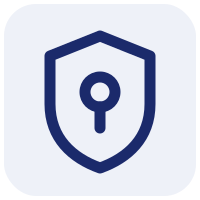
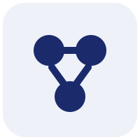
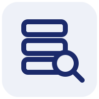
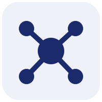
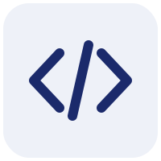
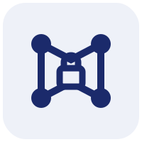
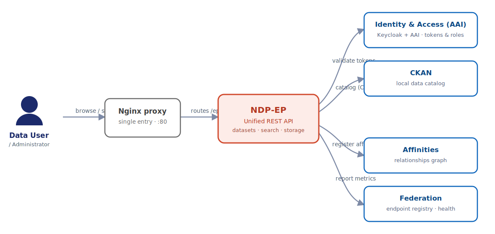

<!--
 PRESENTATION + SELF-GUIDED TUTORIAL — National Data Platform (NDP)
 Audience: end users and administrators (not developers).
 Focus: WHAT you can do and HOW it looks.
 Render:  marp NDP-presentacion.md -o NDP-presentacion.pdf   (or .pptx, .html)
 [📸 ...] blocks mark where to drop a screenshot (folder ./capturas).
 Lines after "<!-- note: ... -->" are speaker notes for whoever presents.
-->

<style>
/* Brand header/footer copied from "ndp ep - presentation.pptx":
   - header: National Data Platform logo (top-left)
   - footer: partner logos band (SDSC . SCI . EarthScope . UCSD . Utah . CU Boulder)
   Applied to every slide as layered section backgrounds so content sits between
   the two bands (padding keeps text clear of them). */
section {
  padding: 96px 48px 80px 48px;
  background-image:
    url('assets/header-logo.png'),
    url('assets/footer-left.png'),
    url('assets/footer-right.png');
  background-repeat: no-repeat, no-repeat, no-repeat;
  background-position:
    left 32px top 22px,
    left 24px bottom 14px,
    right 24px bottom 14px;
  background-size:
    auto 58px,
    auto 44px,
    auto 44px;
}
</style>

# National Data Platform (NDP)
## From zero to a federated, secure dataset

A guided demo of every component and how they work together

<!-- note: introduce in one sentence. "Today we see NDP end to end: install it,
use it from the web and from code, federate it, and connect it securely." -->

---

## What is NDP?

A platform to **publish, discover and share data** across institutions.

- Each institution runs its own **Endpoint (EP)**: its data catalog.
- EPs are **federated**: discovered and shared through a central registry.
- All with shared **identity and permissions** and, optionally, over a
  **secure private network**.

> Key idea: **distributed data, unified discovery.**

<!-- note: avoid jargon; the message is federation + access governance. -->

---

## Platform components

| Piece | What it is for | How it looks |
|---|---|---|
|  **AAI** (Keycloak) | Who you are (login, users) | Login screen |
|  **Affinities** | Which group you belong to and your **role** | Groups web app |
|  **NDP-EP** | Your catalog: datasets, resources, storage | Endpoint web app |
|  **Federation** | Central registry of all EPs | Federation web app |
|  **Python library** | Do the same from code / automate | Notebook / script |
|  **NetBird** (bonus) | Secure private network between machines | Network dashboard |

---

## Component interactions



The user signs in through **AAI**; **Affinities** decides their role; with that token they publish and search in the **NDP-EP** (backed by **CKAN** and **S3**), which registers and reports to **Federation**.

<!-- note: read it top-to-bottom as a journey (not a hub): identity -> role ->
the EP -> federation, with CKAN/S3 as the EP's backends. All of it can run over
a private NetBird network (final bonus). Derived from the C4 view in ../ep-diagrams. -->

---

## Demo walkthrough

> **Ana** is new. We give her access, she publishes a dataset, automates it from
> code, and that data shows up in the federation — all securely.

**Demo acts:**
1. Installation from scratch
2. Identity and permissions (Ana logs in and gets her role)
3. The Endpoint in action (publish and search from the web)
4. Automate with the Python library
5. Federation (the data is discovered elsewhere)
6. 🔒 Bonus: secure network with NetBird

---

# Act 1 — Installation from scratch
### (for administrators)

<!-- note: for end users this can be summarized; for admins, show it is
"docker compose up" per component, in order. -->

---

## Requirements

- A machine with **Docker** and **Docker Compose**.
- Access to each component's repository.
- (Recommended) a domain if you will expose services to the outside.

> In development, **everything fits on a single machine**. In production, each
> component can live on its own server (that is where NetBird comes in).

---

## Startup order

```
1) AAI (Keycloak)      → identity first, everything depends on it
2) Affinities          → groups and roles
3) Federation          → central registry
4) NDP-EP (+ backends)  → catalog, connects to AAI and Federation
        backends: CKAN · MongoDB · MinIO (S3 storage)
```

Each component starts the same way: enter its folder and `docker compose up -d`.

<!-- note: stress: same gesture in each repo; order matters due to dependencies. -->

---

## 1) Start AAI (identity)

```bash
cd ndp-keycloak-aai-old
cp .env.example .env        # set admin user/password
docker compose up -d
```

**What you will see:** the Keycloak admin console and the NDP login screen.

[📸 screenshots/10-keycloak-login.png — NDP "Welcome back" login screen]
[📸 screenshots/11-keycloak-admin.png — Keycloak admin console (realm NDP)]

---

## 2) Start Affinities (groups and roles)

```bash
cd ndp-affinities
docker compose up -d
```

**What you will see (default URLs):**
- API: `http://localhost:8000/docs`
- **Affinities web app**: `http://localhost:3000`
- Database admin (pgAdmin): `http://localhost:5050`

[📸 screenshots/12-affinities-frontend.png — Affinities web app with groups]

---

## 3) Start Federation (central registry)

```bash
cd ndp-federation
docker compose up -d
```

**What you will see:**
- Web: `http://localhost:8020/ui/`
- API & docs: `http://localhost:8020/docs`

[📸 screenshots/13-federation-ui.png — federation web app (EP list, still empty)]

---

## 4) Start the NDP-EP (+ backends)

```bash
cd ep-api
cp .env.example .env        # point to AAI, Affinities, Federation
docker compose up -d
```

Starts the Endpoint alongside its backends: **CKAN**, **MongoDB** and **MinIO** (S3).

**What you will see:**
- **Endpoint web app**: `…/ep-api/ui/`
- API documentation: `…/ep-api/docs`

[📸 screenshots/14-ep-home.png — Endpoint home page (search)]

---

## ✅ Check: everything is up

```bash
docker ps        # all containers "Up / healthy"
```

From here on we work **from the web** (and later from code).

[📸 screenshots/15-docker-ps.png — list of containers in Up state]

<!-- note: close Act 1: "installed in minutes; now let's use it". -->

---

# Act 2 — Identity and permissions
### Ana logs in and gets her role

---

## Create the user (AAI)

In the Keycloak console, the administrator creates **Ana's** user and sets a password.

[📸 screenshots/20-create-user.png — creating a user in Keycloak]

> The user alone **cannot publish anything yet**: she needs a **role**.

---

## Grant the role (Affinities)

Ana is added to a **group** in Affinities. The group determines her **role** in the
Endpoint.

[📸 screenshots/21-affinities-group.png — Ana added to a group with the writer role]

---

## The three roles

| Role | Can… |
|---|---|
| 👁️ **Viewer** | View and search data. **Read-only.** |
| ✏️ **Writer** | The above **+ create/edit** datasets, resources and **S3 management**. |
| 🛠️ **Admin** | All of the above **+ administration** (dashboard, access requests). |

> With no role assigned, a user can only see public data. **Secure by default.**

<!-- note: this is the permission model; it reappears live in Act 3. -->

---

# Act 3 — The Endpoint in action
### Publish and search from the web

---

## Log in

Ana opens the Endpoint web app and logs in with her AAI user.

The home page is the **search**: the heart of the Endpoint.

[📸 screenshots/30-login-and-search.png — login + search page]

---

## Create an organization

From the **"+ New" → Organization** menu, Ana creates the organization that will
group her data.

[📸 screenshots/31-create-organization.png — new organization form]

---

## Publish a dataset

**"+ New" → Dataset**: Ana describes her dataset (title, description, tags…).

[📸 screenshots/32-create-dataset.png — new dataset form]

---

## Add a resource

A dataset can have resources of several kinds, all from **"+ New"**:

- **URL** — a link to a file or service
- **S3** — an object in S3-style storage
- **Kafka** — a streaming data flow

[📸 screenshots/33-create-resource.png — creating a resource (S3/URL/Kafka)]

---

## Search and find

Ana (or anyone) searches by text, filters, and finds the just-published dataset.
On her own data, the **publish/delete** actions appear.

[📸 screenshots/34-search-results.png — search results with the dataset]

---

## Role-based access in practice 🔑

The same web app **looks different depending on your role**:

- 👁️ A **viewer** logs in, searches and looks — **does not see** "S3 Management" or "+ New".
- ✏️ A **writer** does see **"+ New"** and **"S3 Management"** (bucket/object management).
- 🛠️ An **admin** also sees the **Dashboard** and the **access requests**.

[📸 screenshots/35-viewer-vs-writer.png — menu comparison: viewer vs writer]

<!-- note: show the real contrast by opening two sessions (viewer and writer). -->

---

## Storage management (S3) — writers only

**S3 Management** lets you create and manage buckets and objects.
It is a storage administration tool: **writers/admins only**.

[📸 screenshots/36-s3-management.png — S3 Management tool (buckets/objects)]

---

# Act 4 — Automate with Python
### The same thing, from code

<!-- note: for the non-dev audience, frame it as "for power users:
everything in the web can also be automated". -->

---

## The `ndp-ep` library

Everything you do in the web app can also be done **from code**, ideal for
automating or bulk-loading data.

```bash
pip install ndp-ep
```

> Useful for researchers and teams loading data repeatedly.

---

## Example: in a few lines

```python
from ndp_ep import APIClient

# 1. Connect to the Endpoint with your token
client = APIClient(base_url="https://my-endpoint/ep-api", token="…")

# 2. List organizations
print(client.list_organizations())

# 3. Create a dataset and search for it
client.create_dataset(name="measurements-2026", owner_org="my-org")
print(client.search_datasets("measurements"))
```

[📸 screenshots/40-notebook.png — Jupyter notebook running these steps]

<!-- note: if time allows, run it live in a notebook and show the result. -->

---

## Web and code: a unified interface

```
   Web (click)   ─┐
                  ├─►  the SAME Endpoint  ─►  the SAME catalog
   Python (code) ─┘
```

> Web for day-to-day, code to automate. **Same data, same permissions.**

---

# Act 5 — Federation
### The data is discovered elsewhere

---

## The Endpoint registers

Each Endpoint registers with **Federation**. From then on, the central registry
knows it exists and watches its **status** and **metrics**.

[📸 screenshots/50-federation-ep-registered.png — the EP appears in the federation]

---

## Health and metrics

The federation web app shows which Endpoints are **alive**, since when, and with
what activity.

[📸 screenshots/51-federation-health.png — EP health/metrics panel]

---

## Federation benefits

```
        ┌────────────┐
        │ Federation │   "the map of all the data"
        └─────┬──────┘
   ┌──────────┼──────────┐
   ▼          ▼          ▼
[ EP Utah ] [ EP B ]  [ EP C ]     each institution, its catalog
```

> You search in one place and find data from **many** institutions.
> Each one keeps control of **its** data.

---

# 🔒 Bonus — NetBird
### The secure network that ties it all together

---

## The problem

In production, each component lives on a **different machine**.
How do they talk **without** opening ports to the world?

> Answer: a **private encrypted network** (mesh VPN) connecting only our machines.

---

## The solution: NetBird

- Each machine gets a **stable private IP** on a virtual network.
- Traffic goes **directly and encrypted** between machines (WireGuard).
- You decide **who talks to whom**; everything else is blocked.
- **No public ports** for the services.

[📸 screenshots/60-netbird-peers.png — NetBird dashboard with connected machines (peers)]

---

## Demonstrated

Two machines on the network: one **reaches all the NDP services** of the other
(EP, Federation, Affinities, AAI…) **only over the encrypted tunnel**, with no
public ports.

[📸 screenshots/61-netbird-access.png — proof of access to the services over the mesh]

> This is exactly the production multi-machine scenario, already validated.

---

# Conclusion

---

## Summary

1. We **installed** NDP from scratch (Docker).
2. Ana **logged in** (AAI) and received her **role** (Affinities).
3. She **published and searched** data from the Endpoint **web app**.
4. She did the same **from code** with the Python library.
5. The data was **federated** and is discovered elsewhere.
6. Everything can run over a **secure network** (NetBird).

> **Distributed data, unified discovery, governed and secure access.**

---

## Resources

- **Endpoint (web):** `…/ep-api/ui/` · **API:** `…/ep-api/docs`
- **Federation:** `…:8020/ui/`
- **Affinities:** `…:3000`
- **Python library:** `pip install ndp-ep` · PyPI: `ndp-ep`
- **Repos:** `ep-api`, `ndp-federation`, `ndp-affinities`, `ndp-keycloak-aai-old`, `ndp-ep-py`, `netbird-ndp`

---

# Thank you!
## Questions

<!-- note: open the floor for questions; keep the NetBird technical doc handy. -->
