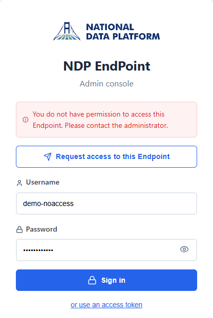
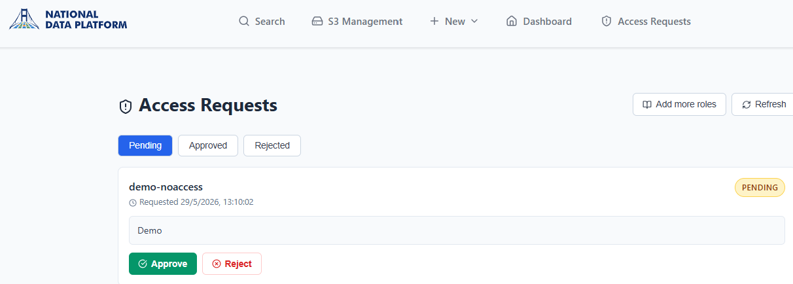
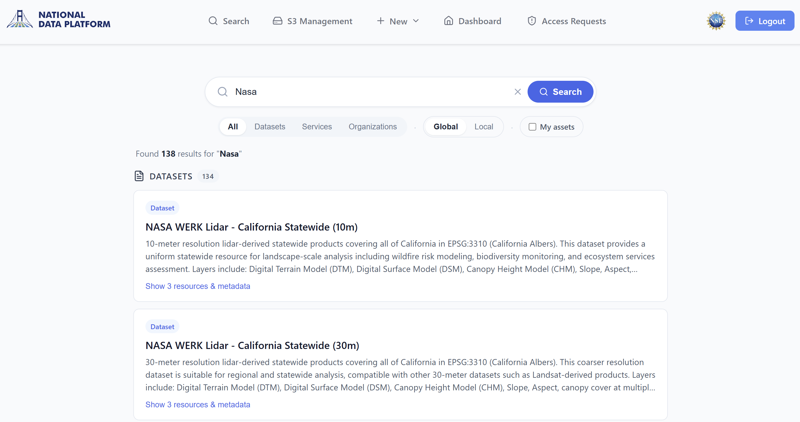
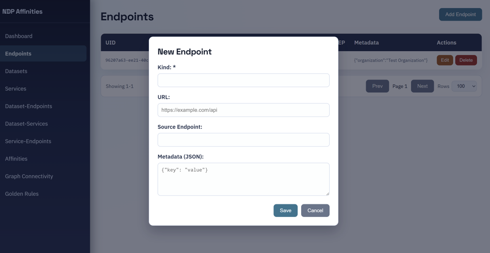

<!--
 PRESENTATION + SELF-GUIDED TUTORIAL — National Data Platform (NDP)
 Audience: end users and administrators (not developers).
 Focus: WHAT you can do and HOW it looks.
 Render:  marp NDP-presentacion.md -o NDP-presentacion.pdf   (or .pptx, .html)
 [📸 ...] blocks mark where to drop a screenshot (folder ./capturas).
 Lines after "<!-- note: ... -->" are speaker notes for whoever presents.
-->

<style>
/* Brand header/footer copied from "ndp ep - presentation.pptx":
   - header: National Data Platform logo (top-left)
   - footer: partner logos band (SDSC . SCI . EarthScope . UCSD . Utah . CU Boulder)
   Applied to every slide as layered section backgrounds so content sits between
   the two bands (padding keeps text clear of them). */
section {
  padding: 96px 48px 80px 48px;
  background-image:
    url('assets/header-logo.png'),
    url('assets/footer-left.png'),
    url('assets/footer-right.png');
  background-repeat: no-repeat, no-repeat, no-repeat;
  background-position:
    left 32px top 22px,
    left 24px bottom 14px,
    right 24px bottom 14px;
  background-size:
    auto 58px,
    auto 44px,
    auto 44px;
}
/* full-slide screenshot slides: center the image */
section.imgslide { text-align: center; }
</style>

# National Data Platform (NDP)
## From zero to a federated, secure dataset

A guided demo of every component and how they work together

<!-- note: introduce in one sentence. "Today we see NDP end to end: install it,
use it from the web and from code, federate it, and connect it securely." -->

---

## What is NDP?

A platform to **publish, discover and share data** across institutions.

- Each institution runs its own **Endpoint (EP)**: its data catalog.
- EPs are **federated**: discovered and shared through a central registry.
- All with shared **identity and permissions** and, optionally, over a
  **secure private network**.

> Key idea: **distributed data, unified discovery.**

<!-- note: avoid jargon; the message is federation + access governance. -->

---

## Platform components

| Piece | What it is for | How it looks |
|---|---|---|
|  **AAI** (Keycloak) | Who you are (login, users) | Login screen |
|  **Affinities** | Relationships between datasets, services and endpoints | Relationships web app |
|  **NDP-EP** | Your catalog: datasets, resources, storage | Endpoint web app |
|  **Federation** | Central registry of all EPs | Federation web app |
|  **Python library** | Do the same from code / automate | Notebook / script |
|  **NetBird** (bonus) | Secure private network between machines | Network dashboard |

---

## Component interactions


<!-- note: narrate the diagram: the user signs in through AAI, which also
carries their ROLE (roles live in AAI/Keycloak, NOT in Affinities). With that
token they publish and search in the NDP-EP, backed by CKAN and S3. The EP then
registers its datasets/services in Affinities (a non-blocking relationship
registry) and reports to Federation. All of it can run over a private NetBird
network (final bonus). Derived from the C4 view in ../ep-diagrams. -->

---

## Component interactions — step by step

1. **Sign in** — the user authenticates through **AAI** (Keycloak), which also carries their **role** (viewer / writer / admin).
2. **Use the Endpoint** — with that token they publish and search in the **NDP-EP**, backed by **CKAN** (catalog) and **MinIO / S3** (storage).
3. **Register relationships** — the EP registers its datasets and services in **Affinities**, a non-blocking graph of how data, services and endpoints relate.
4. **Federate** — the EP reports to **Federation** (central registry + health & metrics).
5. **Secure transport** — all of it can run over a private, encrypted **NetBird** network.

<!-- note: roles live in AAI, NOT in Affinities. Affinities is a relationship
registry the EP writes into; it is non-blocking (the EP works even if it is down). -->

---

## Overview

> A new user is granted access, publishes a dataset, performs the same tasks from
> code, and the dataset becomes discoverable across the federation — all securely.

**Steps:**
1. Installation
2. Identity and permissions (sign in and get a role)
3. The Endpoint in action (publish and search from the web)
4. Automate with the Python library
5. Federation (the data is discovered elsewhere)
6. 🔒 Bonus: secure network with NetBird

---

# Step 1 — Installation

---

## Two ways to install

**🟢 Most users — the NDP-EP only**
Run your own **Endpoint** and connect it to the **National Data Platform**, which
already provides identity (**AAI**), **Affinities** and **Federation**.
→ install **one** component.

**🧪 Full stack — development / testing**
Run all components locally, with no dependency on the central NDP.
→ install **all** components.

> The common case is covered first; the full stack follows.

---

## Before you install — prerequisites

Have these ready; the installer writes them into `.env`:

- **AAI endpoint** — the AAI `…/information` URL, so logins and roles work.
- **Catalog backend** — a MongoDB (Compose can start it) **or** a reachable **CKAN** instance with an admin **API token**.
- **EP_UUID** — required only when using Affinities or per-EP roles (`group:<EP_UUID>:…`). It is the Endpoint's `uid` in Affinities, used as `AFFINITIES_EP_UUID`. → see appendix *Obtaining the EP_UUID*.
- **Object storage** — optional, only for S3 features.

> In the common case, the platform operators provide the AAI endpoint and, if
> applicable, the `EP_UUID`.

---

## Install the NDP-EP (the common case)

> ⚠️ **For system administrators.** Installation involves Docker, networking and
> environment configuration — it should be done by someone with sysadmin skills.

```bash
git clone https://github.com/national-data-platform/ep-api.git
cd ep-api
cp example.env .env      # configure your deployment
docker compose up -d     # the Endpoint only
```

> The CKAN backend requires an existing, reachable CKAN instance and an administrator API token (`CKAN_API_KEY`). The MongoDB backend has no such prerequisite.

> Run only the Endpoint, or add local backends with **Compose profiles** (next slide).

> 📖 `.env` variables are explained in **`docs/configuration.md`** (template: `example.env`).

---

## Compose profiles — core backends

`docker compose --profile <name> up -d` — combine as many as you need:

| Profile | What it starts |
|---|---|
| *(none)* | **NDP-EP only** (API + web UI) |
| `mongodb` | MongoDB + Mongo Express (local catalog DB) |
| `s3` | MinIO (S3-compatible object storage) |
| `kafka` | Kafka + Zookeeper + Kafka UI (streaming) |

---

## Compose profiles — extras

| Profile | What it starts |
|---|---|
| `jupyter` | JupyterLab |
| `pelican` | Pelican federation (registry, director, origin, cache) |
| `full` | All backends above |

<!-- note: profiles let an admin run only the EP (connecting to the platform's
shared services) or spin up local backends for development/testing. -->

---

## What you operate vs. what the platform provides

| 🛠️ You operate (your Endpoint) | ☁️ Shared by the platform |
|---|---|
| **NDP-EP** — API + web UI | **AAI** — identity & roles |
| **Catalog database** — CKAN or MongoDB | **Affinities** — relationship registry |
| **Object storage** — MinIO / S3 *(optional)* | **Federation** — registry & discovery |


<!-- note: this is the responsibility boundary. In the common case you only run
the EP + its data backends; identity/affinities/federation are the platform's. -->

---

# Full stack (development / testing)
### Only if you want the whole system locally

<!-- note: this whole sub-section is the dev/test path. Most users skip it and
just run the NDP-EP from the previous slide. -->

---

## Startup order (full stack)

```
1) AAI (Keycloak)      → identity first, everything depends on it
2) Affinities          → relationships (data · services · endpoints)
3) Federation          → central registry
4) NDP-EP (+ backends)  → catalog, connects to AAI and Federation
        backends: CKAN · MongoDB · MinIO (S3 storage)
```

Each component starts the same way: enter its folder and `docker compose up -d`.

<!-- note: stress: same gesture in each repo; order matters due to dependencies. -->

---

## 1) Start AAI (identity)

```bash
git clone https://github.com/sci-ndp/ndp-keycloak-aai-old.git
cd ndp-keycloak-aai-old
cp .env_template .env        # set admin user/password + domain
# place fullchain.pem & privkey.pem in SSL/certificates/  (TLS)
docker compose up -d --build
```

**What you will see:** the Keycloak admin console and the NDP login screen.

<!-- 📸 screenshots/10-keycloak-login.png — NDP "Welcome back" login screen -->
<!-- 📸 screenshots/11-keycloak-admin.png — Keycloak admin console (realm NDP) -->

---

## 2) Start Affinities (relationship registry)

```bash
git clone https://github.com/sci-ndp/ndp-affinities.git
cd ndp-affinities
cp .env.example .env         # optional: customize DB user/password
docker compose up -d
```

**What you will see (default URLs):**
- API: `http://localhost:8000/docs`
- **Affinities web app**: `http://localhost:3000`
- Database admin (pgAdmin): `http://localhost:5050`

<!-- 📸 screenshots/12-affinities-frontend.png — Affinities web app (relationships graph) -->

---

## 3) Start Federation (central registry)

```bash
git clone https://github.com/sci-ndp/ndp-federation.git
cd ndp-federation
cp .env.example .env         # set ADMIN_PASSWORD
docker compose up -d
```

**What you will see:**
- Web: `http://localhost:8020/ui/`
- API & docs: `http://localhost:8020/docs`

<!-- 📸 screenshots/13-federation-ui.png — federation web app (EP list, still empty) -->

---

## 4) Start the NDP-EP (+ backends)

Identical to the common-case install. Configure `.env` to reference the local
AAI, Affinities and Federation instances, and start the data backends with a
Compose profile.

```bash
docker compose --profile full up -d    # Endpoint + MongoDB + MinIO + Kafka
```

**What you will see:** the Endpoint web app at `…/ep-api/ui/`, now wired to your local stack.

---

## ✅ Check: everything is up

```bash
docker ps        # all containers "Up / healthy"
```

The NDP-EP is now reachable two ways:

- **Web UI** — `…/ep-api/ui/`
- **HTTP API** — `…/ep-api/` (interactive docs at `…/ep-api/docs`)

<!-- 📸 screenshots/15-docker-ps.png — list of containers in Up state -->
<!-- note: close Step 1: "installed in minutes; now let's use it". The UI and the
API are the same Endpoint — same data, same permissions. -->

---

# Step 2 — Identity and permissions
### A user signs in and gets a role

---

## Bootstrap the first admin

The Endpoint has **no user store** — identity and roles come from **AAI (Keycloak)**.
How the first admin is created depends on the deployment:

- **🟢 NDP infrastructure (common case)** — register your Endpoint through the NDP
  platform's onboarding process. It provisions the stack and your admin access;
  the platform operators manage identity.
- **🧪 Full stack (self-hosted)** — you assign the admin role yourself in your own
  Keycloak (next slide).

<!-- note: historically the platform onboarding used a federation config_id fed to
a setup script (github.com/sci-ndp/NDP-EP); confirm the current portal/process
with the platform operators. -->

---

## Bootstrap the first admin — full stack

Self-hosted only. In your Keycloak (realm **NDP**) — granting roles from the EP UI
or the AAI API requires an existing admin, so the first one is set here:

1. Create the user and set a password.
2. Assign the realm role **`ndp_admin`** (platform-wide), or **`group:<EP_UUID>:admin`** for this Endpoint only (`EP_UUID` → see appendix *Obtaining the EP_UUID*).

That user can then sign in and manage everyone else via the AAI API / EP.

<!-- 📸 screenshots/19-keycloak-assign-ndp-admin.png — assigning the ndp_admin realm role in Keycloak -->

---

## Where users come from (AAI)

Depends on the deployment:

- **🟢 NDP infrastructure (common case)** — users are existing **nationaldataplatform.com** accounts; they sign in with their NDP identity. You do not create them.
- **🧪 Full stack (self-hosted)** — create them in your own **Keycloak** (Users → Add user → set password). → see appendix *Creating a user — Keycloak*.

> A user alone **cannot publish anything yet** — they still need a **role**.

---

## Requesting access (user)

A new user has **no role**, so the Endpoint denies access — but offers a
**Request access** form with an optional justification.

> Requires `ENABLE_ACCESS_REQUESTS=True`.

---

<!-- _class: imgslide -->



---

## Approving access (admin)

On the **Access Requests** page, an admin reviews pending requests and **approves**
each with a tier — **Viewer**, **Writer** or **Admin** — or **rejects** it.

> Approval assigns the role; the user re-logs in to pick it up.

---

<!-- _class: imgslide -->



---

## The three roles

Roles come from **AAI** and are hierarchical (each tier includes the ones below):

| Role | Can do |
|---|---|
| 👁️ **Viewer** | View and search data. **Read-only.** |
| ✏️ **Writer** | The above **+ create/edit** datasets, resources, and **S3 management**. |
| 🛠️ **Admin** | All of the above **+ administration** (dashboard, access requests). |

> With no role assigned, a user can only see public data. **Secure by default.**

<!-- note: this is the permission model; it reappears live in Step 3. -->

---

# Step 3 — The Endpoint in action
### Search, publish and manage from the web

---

## Search — the landing page

The home page is **Search**, available to **everyone** (including viewers).
Free-text search across **name, description and keywords**.

---

## Search — options

- **Category** — All · Datasets · Services · Organizations
- **Catalog** — **Local** (this Endpoint) or **Global** (the federated NDP catalog)
- **Organization** filter, and **Yours** (only items you own)
- On your own items: **Publish** and **Delete** actions (role/ownership-gated)

---

<!-- _class: imgslide -->



---

## The "+ New" menu

Available to **writers and admins**. Six creation flows, in two groups:

| Kind | What it is |
|---|---|
| **Organization** | Top-level group that owns datasets and services |
| **Dataset** | Logical container of related resources, owned by an organization |
| **Service** | Network-accessible service (REST API, app, etc.) owned by an organization |
| **URL resource** | Link to a file or service (CSV, JSON, NetCDF, …) |
| **S3 resource** | Object in S3-compatible storage |
| **Kafka topic** | Streaming data flow |

---

## "+ New" — Organization

A top-level **group** that owns datasets and services.

- **`name`** — Unique slug used as the organization ID and in URLs (lowercase letters, digits, `_`, `-`).
  *Example:* `atmospheric-research`
- **`title`** — Human-readable display title shown across the UI.
  *Example:* `Atmospheric Research Lab`
- **`description`** *(opt.)* — Free-text description shown on the organization page.
  *Example:* `Group publishing radar and atmospheric datasets for research.`

---

## "+ New" — Dataset (required)

A logical container of related **resources**, owned by an organization.

- **`name`** — Unique slug for the dataset; appears in the URL (lowercase, alphanumeric, `_`, `-`).
  *Example:* `nexrad-reflectivity-2025`
- **`title`** — Human-readable title displayed on the dataset page.
  *Example:* `NEXRAD reflectivity composites, 2025`
- **`owner_org`** — ID of the organization that owns this dataset (must already exist).
  *Example:* `atmospheric-research`

---

## "+ New" — Dataset (optional, 1/2)

Describe the dataset and make it findable.

- **`notes`** — Longer description / notes shown on the dataset page.
  *Example:* `Hourly NEXRAD Level-II reflectivity composites over CONUS, 2025-01 to 2025-12.`
- **`tags`** — Short keywords used to categorize and search.
  *Example:* `["radar", "nexrad", "reflectivity", "2025"]`
- **`groups`** — Catalog **groups** (collections of datasets) the dataset belongs to.
  *Example:* `["weather", "remote-sensing"]`
- **`license_id`** — License identifier (CKAN license slug).
  *Example:* `cc-by`
- **`version`** — Free-text version label.
  *Example:* `v1.2.0`

---

## "+ New" — Dataset (optional, 2/2)

Extra metadata, embedded resources and visibility.

- **`extras`** — Free-form metadata as key/value pairs.
  *Example:* `{"region": "CONUS", "instrument": "NEXRAD"}`
- **`resources`** — Resources attached at creation (each `{url, name, format?, …}`).
  *Example:* `[{"url": "https://data.example.org/radar/2025-01.nc", "name": "jan-2025", "format": "NetCDF"}]`
- **`private`** *(default `false`)* — Whether the dataset is private (only visible to its org).
  *Example:* `false`

---

## "+ New" — Service (required)

A network-accessible **service** (REST API, web app, etc.) registered under the `services` org.

- **`service_name`** — Unique service slug (1–100 chars).
  *Example:* `radar-stats-api`
- **`service_title`** — Display title (1–200 chars).
  *Example:* `Radar Statistics API`
- **`owner_org`** — Organization ID; **must be `services`** (all services live there).
  *Example:* `services`
- **`service_url`** — URL where the service is reachable (`http(s)://…`).
  *Example:* `https://api.atmospheric-research.org/radar/stats`

---

## "+ New" — Service — `service_type` *(optional)*

What kind of service this is — used by the UI to label and filter.
The UI offers three canonical options plus a free-text fallback (≤ 50 chars).

- **API** — programmatic interface (REST/HTTP, GraphQL, gRPC…) called by code.
  *Example:* `API`
- **UI** — human-facing interface (web app, dashboard, viewer…) opened in a browser.
  *Example:* `UI`
- **Trigger** — event source / scheduled job (webhook, cron, producer…) that runs on its own.
  *Example:* `Trigger`
- *…or any custom free-text value when none of the above applies.*

---

## "+ New" — Service (other optional)

Round out the service entry.

- **`notes`** — Description or additional notes.
  *Example:* `RESTful API exposing aggregated reflectivity statistics from the NEXRAD datasets.`
- **`health_check_url`** — URL of a health endpoint (`http(s)://…`) used for liveness checks.
  *Example:* `https://api.atmospheric-research.org/radar/stats/health`
- **`documentation_url`** — URL to the service documentation.
  *Example:* `https://docs.atmospheric-research.org/radar-stats`
- **`extras`** — Free-form metadata as key/value pairs.
  *Example:* `{"version": "2.1.0", "environment": "production"}`

---

## "+ New" — URL resource (required)

A **link to a file or service** registered as a resource of a dataset.

- **`resource_name`** — Unique slug for the resource (lowercase, alphanumeric, `_`, `-`).
  *Example:* `radar-jan-2025`
- **`resource_title`** — Display title.
  *Example:* `Radar reflectivity — January 2025`
- **`owner_org`** — Organization that owns the resource.
  *Example:* `atmospheric-research`
- **`resource_url`** — URL of the file or service (must start with `http(s)://`).
  *Example:* `https://data.example.org/nexrad/2025-01.nc`

---

## "+ New" — URL resource (`file_type` & processing)

Help the catalog interpret the content of the URL.

- **`file_type`** — `stream`, `CSV`, `TXT`, `JSON`, `NetCDF`, or a custom value.
  *Example:* `CSV`
- **`processing`** *(type-specific)* — how to read the file:
  - **CSV:** `{"delimiter": ",", "header_line": 1, "start_line": 2}`
  - **JSON:** `{"data_key": "results"}`
  - **NetCDF:** `{"group": "/radar"}`

---

## "+ New" — URL resource (other optional)

- **`mapping`** — Field mapping: which fields to expose and how to rename them.
  *Example:* `{"refl": "reflectivity_dBZ", "ts": "timestamp"}`
- **`notes`** — Additional notes about the resource.
  *Example:* `Hourly NetCDF files; missing values flagged with -9999.`
- **`extras`** — Free-form metadata as key/value pairs.
  *Example:* `{"region": "CONUS", "cadence": "1h"}`

---

## "+ New" — S3 resource (identification)

An **object in S3-compatible storage** registered as a resource.

- **`resource_name`** — Unique slug (lowercase, alphanumeric, `_`, `-`).
  *Example:* `radar-archive-2025`
- **`resource_title`** — Display title.
  *Example:* `NEXRAD radar archive, 2025`
- **`owner_org`** — Organization ID that owns the resource.
  *Example:* `atmospheric-research`

---

## "+ New" — S3 resource (S3 details)

- **`resource_s3`** — S3 URL of the object (`s3://bucket/path`, or `http(s)://…`).
  *Example:* `s3://nexrad-archive/2025/`
- **`notes`** *(required; may be empty)* — Notes about the resource.
  *Example:* `Annual archive of NEXRAD Level-II composites, partitioned by month.`
- **`extras`** *(opt.)* — Free-form metadata as key/value pairs.
  *Example:* `{"format": "NetCDF", "size_GB": 480}`

---

## "+ New" — Kafka topic (required)

A **streaming data flow** registered as a system dataset.

- **`dataset_name`** — Unique slug for the dataset entry.
  *Example:* `nexrad-live`
- **`dataset_title`** — Display title.
  *Example:* `NEXRAD radar — live stream`
- **`owner_org`** — Organization that owns the dataset.
  *Example:* `atmospheric-research`
- **`dataset_description`** — Description of the stream.
  *Example:* `Live JSON feed of NEXRAD radar volume scans, ~5 min cadence.`

---

## "+ New" — Kafka topic (broker)

Point at the broker and the topic.

- **`kafka_topic`** — Kafka topic name.
  *Example:* `nexrad.live`
- **`kafka_host`** — Kafka broker host.
  *Example:* `kafka.atmospheric-research.org`
- **`kafka_port`** — Broker port (1–65535).
  *Example:* `9092`

---

## "+ New" — Kafka topic (options)

Shape the messages.

- **`mapping`** *(opt.)* — Field mapping (select/rename fields to send).
  *Example:* `{"refl": "reflectivity_dBZ", "ts": "timestamp"}`
- **`processing`** *(opt.)* — Processing config.
  *Example:* `{"data_key": "data", "info_key": "metadata"}`
- **`extras`** *(opt.)* — Free-form metadata.
  *Example:* `{"avg_msgs_per_min": 12, "schema": "https://schemas.example.org/radar.json"}`

<!-- 📸 screenshots/33-create-resource.png — example: a "+ New" creation form -->

---

## Storage management (S3) — writers only

Manage **buckets** and **objects** in S3-compatible storage from the UI.

**Requires:**
- `S3_ENABLED=True` in `.env`, plus `S3_ENDPOINT`, `S3_ACCESS_KEY`, `S3_SECRET_KEY` (and optionally `S3_SECURE`, `S3_REGION`).
- **Writer or admin** role — the menu entry is hidden otherwise; the API returns `403` to read-only users.

<!-- 📸 screenshots/36-s3-management.png — S3 Management tool (buckets/objects) -->

---

## S3 Management — buckets

A list view (Bucket name · Created · Actions) with a filter to find buckets quickly.

- **Create** a bucket (name + region).
- **List** all buckets with creation dates.
- **Search / filter** by name.
- **View** bucket information and metadata.
- **Delete** a bucket (must be empty — no objects).
- **Refresh** the list.

---

## S3 Management — objects

Select a bucket → manage its objects (Name · Size · Last modified · Type).

- **Upload** files via drag-and-drop or the file picker.
- **List** objects in the bucket.
- **Search** by prefix / path.
- **Download** an object to your computer.
- **View** detailed object **metadata**.
- **Generate a presigned URL** — a temporary, authenticated link for secure sharing.
- **Delete** individual objects.

---

# Step 4 — Automate with Python
### The same operations, from code

<!-- note: for the non-dev audience, frame it as "for power users:
everything in the web can also be automated". -->

---

## The `ndp-ep` library

Every web-app operation is also available **from code** — suitable for automation
and bulk loading.

```bash
pip install ndp-ep
```

> Intended for researchers and teams that load data programmatically.

---

## Example: in a few lines

```python
from ndp_ep import APIClient

# 1. Connect to the Endpoint with your token
client = APIClient(base_url="https://my-endpoint/ep-api", token="…")

# 2. List organizations
print(client.list_organizations())

# 3. Create a dataset and search for it
client.create_dataset(name="measurements-2026", owner_org="my-org")
print(client.search_datasets("measurements"))
```

<!-- 📸 screenshots/40-notebook.png — Jupyter notebook running these steps -->
<!-- note: if time allows, run it live in a notebook and show the result. -->

---

## Web and code: a unified interface

```
   Web (click)   ─┐
                  ├─►  the SAME Endpoint  ─►  the SAME catalog
   Python (code) ─┘
```

> The web interface and the library target the same Endpoint: **identical data and permissions.**

---

# Step 5 — Federation
### The data is discovered elsewhere

---

## The Endpoint registers

Each Endpoint registers with **Federation**. The central registry then tracks its
**status** and **metrics**.

<!-- 📸 screenshots/50-federation-ep-registered.png — the EP appears in the federation -->

---

## Health and metrics

The federation web app reports which Endpoints are **online**, since when, and
their activity.

<!-- 📸 screenshots/51-federation-health.png — EP health/metrics panel -->

---

## What the Endpoint reports

Every `METRICS_INTERVAL_SECONDS` (default **55 min**) — and only when `IS_PUBLIC=True` — the Endpoint posts a JSON payload to `METRICS_ENDPOINT`:

**Identity & version**
- `organization`, `ep_name`, `version` (EP API version), `public_ip`, `timestamp`.

**Catalog activity**
- `num_datasets`, `num_services`, `services` (list of service titles).

**Host load**
- `cpu` (%), `memory` (`used/total GB`), `disk` (`used/total GB`).

---

## What the Endpoint reports — infrastructure flags

Which features this Endpoint exposes — booleans, plus a few details when enabled.

- `jupyterlab_enabled` *(if true: `jupyterlab_url`)*
- `kafka_enabled` *(if true: `kafka_host`, `kafka_port`)*
- `s3_enabled`
- `pre_ckan_enabled`

> No tokens, user data or dataset content are sent — only counts, infrastructure flags and host load. Federation drops the report if it cannot reach the endpoint, so the EP keeps working when the federation is down.

---

## 🔒 Bonus — NetBird

**[NetBird](https://netbird.io)** — open-source mesh VPN built on **WireGuard**.

- Each machine joins a private virtual network and gets a **stable private IP**.
- Traffic flows **directly and encrypted** between authorized peers; access is restricted by policy.
- **No public ports** are exposed for the services themselves.

**Why it matters for NDP:** when the Endpoint and the platform components run on different machines, NetBird connects them over a single private overlay — no per-service firewall opening.

---

## Resources

- **Endpoint (web):** `…/ep-api/ui/` · **API:** `…/ep-api/docs`
- **Federation:** `…:8020/ui/`
- **Affinities:** `…:3000`
- **Python library:** `pip install ndp-ep` · PyPI: `ndp-ep`
- **Repos:** `ep-api`, `ndp-federation`, `ndp-affinities`, `ndp-keycloak-aai-old`, `ndp-ep-py`, `netbird-ndp`

---

# Appendix

---

## Obtaining the EP_UUID — Affinities web app

In the Affinities web app (`http://localhost:3000`, or your Affinities URL):
**Endpoints → Add Endpoint**, fill the form (**Kind** = `ndp-ep`, **URL**, optional
**Metadata**), then **Save**. The new row's **UID** is your `AFFINITIES_EP_UUID`.



---

## Obtaining the EP_UUID — Affinities API

**Via the Affinities API** (`http://localhost:8000`, Swagger at `/docs`):

```bash
# list endpoints and copy your uid
curl http://localhost:8000/ep

# or register this endpoint; the response includes "uid"
curl -X POST http://localhost:8000/ep -H 'Content-Type: application/json' \
  -d '{"kind":"ndp-ep","url":"https://<your-ndp-ep>","metadata":{"name":"My EP"}}'
```

The returned `uid` is your `AFFINITIES_EP_UUID`.

---

## Creating a user — Keycloak

In the Keycloak admin console, realm **NDP**:

1. **Users → Add user** — set **Username** and the required profile fields (email, first/last name), then **Create**.
2. Open the user → **Credentials → Set password** — turn **Temporary** off, then **Save**.


---

## Assigning groups & roles — AAI API

After the user exists in Keycloak, assign groups/roles via the **AAI API**
(the caller must already be an admin):

```bash
# authenticate as an admin
TOKEN=$(curl -s -X POST "$AAI/user/login" -H 'Content-Type: application/json' \
  -d '{"username":"<admin>","password":"<pass>"}' | jq -r .access_token)

# join the EP group (assigned the viewer role automatically)
curl -s -X POST "$AAI/group/add-user" -H "Authorization: Bearer $TOKEN" \
  -H 'Content-Type: application/json' \
  -d '{"group_name":"<EP_UUID>","username":"<user>"}'
```

---

## Assigning groups & roles — AAI API (cont.)

Upgrade the tier (bare name: `viewer` | `writer` | `admin`):

```bash
curl -s -X POST "$AAI/role/assign" -H "Authorization: Bearer $TOKEN" \
  -H 'Content-Type: application/json' \
  -d '{"groupName":"<EP_UUID>","roleName":"writer","username":"<user>"}'
```

> **First admin exception:** assign `ndp_admin` **directly in Keycloak** — no admin
> exists yet to call this API. The user must re-login for new roles to take effect.

---

## Tokens stored at NDP-managed onboarding

When the Endpoint is installed via the **nationaldataplatform.com** registration
(NDP infrastructure case), the onboarding process also **stores the access tokens
for the various catalogs** (CKAN sysadmin token, Pre-CKAN API key, etc.) on the
host — typically in each component's `.env` and a summary `user_info.env` — so
the Endpoint can read and write to them without manual token setup.
