<!--
 PRESENTATION + SELF-GUIDED TUTORIAL — National Data Platform (NDP)
 Audience: end users and administrators (not developers).
 Focus: WHAT you can do and HOW it looks.
 Render (from docs/demo/):
   npx @marp-team/marp-cli --allow-local-files NDP-demo-presentation.md -o NDP-demo-presentation.pdf
   (or --pptx / .html; see README.md)
 Screenshots live in ./screenshots and are shown on "imgslide" slides.
 Comments starting with "note:" are speaker notes for whoever presents.
 Placeholders used below: <endpoint-url> is the Endpoint's address,
 http://<host>:8002 by default (port EP_API_PORT, plus ROOT_PATH when set).
-->

<style>
/* Brand header/footer copied from "ndp ep - presentation.pptx":
   - header: National Data Platform logo (top-left)
   - footer: partner logos band (SDSC . SCI . EarthScope . UCSD . Utah . CU Boulder)
   Applied to every slide as layered section backgrounds so content sits between
   the two bands (padding keeps text clear of them). */
section {
  padding: 96px 48px 80px 48px;
  background-image:
    url('assets/header-logo.png'),
    url('assets/footer-left.png'),
    url('assets/footer-right.png');
  background-repeat: no-repeat, no-repeat, no-repeat;
  background-position:
    left 32px top 22px,
    left 24px bottom 14px,
    right 24px bottom 14px;
  background-size:
    auto 58px,
    auto 44px,
    auto 44px;
}
/* full-slide screenshot slides: center the image */
section.imgslide { text-align: center; }
</style>

# National Data Platform (NDP)
## From zero to a federated, secure dataset

A guided demo of every component and how they work together

<!-- note: introduce in one sentence. "Today we see NDP end to end: install it,
use it from the web and from code, federate it, and connect it securely." -->

---

## What is NDP?

A platform to **publish, discover and share data** across institutions.

- Each institution runs its own **Endpoint (EP)**: its data catalog.
- EPs are **federated**: registered in a central registry, the **Federation**.
- All with shared **identity and permissions** and, optionally, over a
  **secure private network**.

> Key idea: **distributed data, unified discovery.**

<!-- note: avoid jargon; the message is federation + access governance. -->

---

## Platform components

| Piece | What it is for | How it looks |
|---|---|---|
| 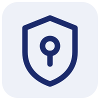 **AAI** (Keycloak) | Who you are (login, users, roles) | Login screen |
| 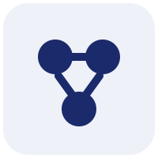 **Affinities** | Relationships between datasets, services and endpoints | Relationships web app |
|  **NDP-EP** | Your catalog: datasets, resources, storage | Endpoint web app |
| 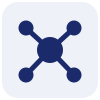 **Federation** | Central registry of all EPs | Federation web app |
| 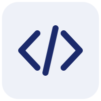 **Python library** | Do the same from code / automate | Notebook / script |
| 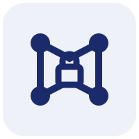 **NetBird** (bonus) | Secure private network between machines | Network dashboard |

---

## Component interactions

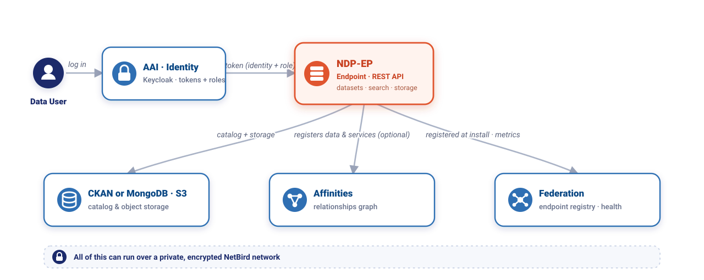

<!-- note: narrate the diagram: the user signs in through AAI, whose token
carries their ROLE (roles live in AAI/Keycloak, NOT in Affinities). With that
token they publish and search in the NDP-EP, backed by a local catalog (CKAN or
MongoDB, or none) and optional S3 storage; the diagram shows CKAN and MinIO.
When the Affinities integration is on, the EP registers the datasets and
services it creates in Affinities. The EP is registered with Federation at
install time and then reports metrics to it. All of it can run over a private
NetBird network (final bonus). -->

---

## Component interactions — step by step

1. **Sign in** — through **AAI** (Keycloak); the token carries the user's **role** (viewer / writer / admin).
2. **Use the Endpoint** — publish and search in the **NDP-EP**, backed by a local catalog (**CKAN** or **MongoDB**) and optional **S3** storage.
3. **Register relationships** — with `AFFINITIES_ENABLED=True`, the EP registers the datasets and services it creates in **Affinities** (non-blocking).
4. **Federate** — the installer registers the EP with **Federation**; the running EP then posts **metrics** to it.
5. **Secure transport** — all of it can run over a private, encrypted **NetBird** network.

<!-- note: roles live in AAI, NOT in Affinities. Affinities is a relationship
registry; the EP keeps working if it is down. The installer leaves the
Affinities integration off (AFFINITIES_ENABLED=False). -->

---

## Overview

> A new user is granted access, publishes a dataset, performs the same tasks from
> code, and the Endpoint shows up in the federation — all securely.

**Steps:**
1. Installation
2. Identity and permissions (sign in and get a role)
3. The Endpoint in action (publish and search from the web)
4. Automate with the Python library
5. Federation (the Endpoint is registered and reports)
6. 🔒 Bonus: secure network with NetBird

---

# Step 1 — Installation

---

## Two ways to install

**🟢 Most users — the NDP-EP only**
Run your own **Endpoint** and connect it to the **National Data Platform**, which
already provides identity (**AAI**), **Affinities** and **Federation**.
→ install **one** component, with the **installer**.

**🧪 Full stack — development / testing**
Run all components locally, with no dependency on the central NDP.
→ install **all** components.

> The common case is covered first; the full stack follows.

---

## Before you install — prerequisites

- **A host with** Docker and Docker Compose, `curl` and `python3` (`git` too
  when the installer has to clone the repository or install CKAN).
- **A Federation configuration id** *(optional)* — from the platform's
  create-endpoint page, or obtained by **registering from the installer** with
  your NDP access token. Without one, the Endpoint is standalone.
- **AAI URL** — the installer proposes the platform's
  `https://idp.nationaldataplatform.org/temp/information`.
- **Your choices** — local catalog (none · MongoDB · CKAN, installed or
  existing), S3 storage (bundled MinIO or existing), access requests.

> The installer asks for all of this and writes `.env`; nothing is started
> until every answer is given.

---

## Install the NDP-EP (the common case)

> ⚠️ **For system administrators.** Installation involves Docker, networking and
> environment configuration.

From a checkout:

```bash
git clone https://github.com/national-data-platform/ep-api.git
cd ep-api
./install/install.sh --config-id <your-federation-config-id>
```

Or straight from the web (clones into `~/ndp-ep` and runs from there):

```bash
bash <(curl -fsSL https://raw.githubusercontent.com/national-data-platform/ep-api/main/install/install.sh) [options]
```

---

## What the installer does

1. **Asks** (or reads flags): configuration id, local catalog, S3,
   registration, port (default `8002`), AAI URL, access requests.
2. **Renders `.env`** from `example.env` (an existing `.env` is first saved as
   `.env.backup.<timestamp>`).
3. **Picks Compose profiles** and runs `docker compose --profile … up -d --build`.
4. **Waits for `/health`** and prints the UI address.

**Re-running it upgrades** the Endpoint: it renders `.env` again and rebuilds
the image from the checkout.

> 📖 Every flag: **`install/README.md`** · every `.env` variable:
> **`docs/configuration.md`**.

---

## Compose profiles — core backends

The installer chooses these for you; by hand:
`docker compose --profile <name> up -d --build` — combine as many as you need.

| Profile | What it starts |
|---|---|
| *(none)* | **NDP-EP only** (API + web UI) |
| `mongodb` | MongoDB (local catalog, access requests) |
| `s3` | S3-compatible storage (`pgsty/silo`, a MinIO fork) |
| `kafka` | ZooKeeper + Kafka + Kafka UI (streaming) |

> The installer only ever adds `mongodb`, `s3` and `kafka`.

---

## Compose profiles — extras

| Profile | What it starts |
|---|---|
| `mongo-express` | Mongo Express (MongoDB web console) |
| `jupyter` | JupyterLab |
| `pelican` | Pelican federation (registry, director, origin, cache) |
| `full` | Every service above, extras included |

<!-- note: profiles let an admin run only the EP (connecting to the platform's
shared services) or spin up local backends for development/testing. The
installer never starts mongo-express: it exposes the whole database with the
same demo credentials everywhere. -->

---

## What you operate vs. what the platform provides

| 🛠️ You operate (your Endpoint) | ☁️ Shared by the platform |
|---|---|
| **NDP-EP** — API + web UI | **AAI** — identity & roles |
| **Local catalog** — CKAN or MongoDB *(optional)* | **Affinities** — relationship registry |
| **Object storage** — MinIO / S3 *(optional)* | **Federation** — registry & metrics |


<!-- note: this is the responsibility boundary. In the common case you only run
the EP + its data backends; identity/affinities/federation are the platform's.
An Endpoint with no local catalog still searches the global catalog. -->

---

# Full stack (development / testing)
### Only if you want the whole system locally

<!-- note: this whole sub-section is the dev/test path. Most users skip it and
just run the installer from the previous slides. -->

---

## Startup order (full stack)

```
1) AAI (Keycloak)      → identity first, everything depends on it
2) Affinities          → relationships (data · services · endpoints)
3) Federation          → central registry
4) NDP-EP (+ backends) → catalog; uses AAI, reports to Federation
        backends: MongoDB or CKAN · S3 storage · Kafka
```

Each component is a separate project, started with Docker Compose from its
own checkout.

<!-- note: order matters due to dependencies. -->

---

## 1) Start AAI (identity)

AAI is a separate project:

```bash
git clone https://github.com/sci-ndp/ndp-keycloak-aai-old.git
```

Configure and start it as described in **that project's README**; its settings
are not covered here.

**What you will see:** a login screen and the Keycloak admin console.


---

## 2) Start Affinities (relationship registry)

```bash
git clone https://github.com/sci-ndp/ndp-affinities.git
cd ndp-affinities
cp .env.example .env         # optional: every variable has a default
docker compose up -d --build
```

**What you will see (default URLs):**
- API: `http://localhost:8000/docs`
- **Affinities web app**: `http://localhost:3000`
- Database admin (pgAdmin): `http://localhost:5050`

> The Affinities API has **no authentication**: restrict it at network level.

---

<!-- _class: imgslide -->

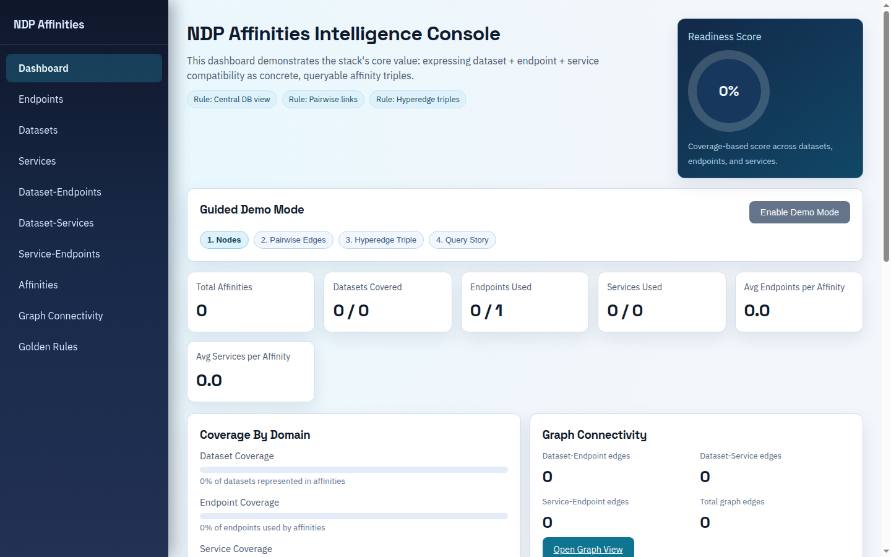


---

## 3) Start Federation (central registry)

```bash
git clone https://github.com/sci-ndp/ndp-federation.git
cd ndp-federation
cp .env.example .env   # set ADMIN_PASSWORD, plus Keycloak and CKAN values
docker compose up -d
```

**What you will see:**
- Admin web app: `http://localhost:8020/ui/` (sign in with `ADMIN_PASSWORD`)
- Owner portal: `http://localhost:8020/ui/portal/`
- API docs: `http://localhost:8020/docs`

---

<!-- _class: imgslide -->

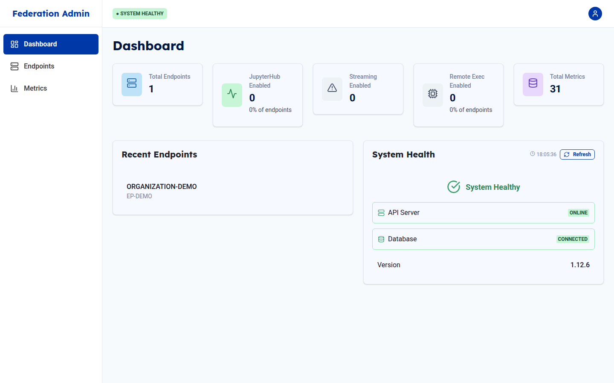

---

## 4) Start the NDP-EP — with the installer

Point the installer at your local Federation and AAI:

```bash
./install/install.sh --federation-url http://<host>:8020
```

- Answer the **AAI URL** prompt with your AAI's information URL.
- The installer writes `METRICS_ENDPOINT=<federation-url>/metrics/`.
- Registering needs the Federation's Keycloak and CKAN settings in place.
- The installer leaves **Affinities off**: set `AFFINITIES_ENABLED=True`,
  `AFFINITIES_URL` and `AFFINITIES_EP_UUID` in `.env` by hand.

> From inside the EP container, a service on the host is `host.docker.internal`.

---

## 4) Start the NDP-EP — every backend

Without the installer, `.env` is edited by hand (template: `example.env`), and
the `full` profile starts every optional service:

```bash
cp example.env .env           # then edit it
docker compose --profile full up -d --build
```

`full` = MongoDB, Mongo Express, S3 storage, ZooKeeper + Kafka + Kafka UI,
JupyterLab and Pelican.

**What you will see:** the Endpoint web app at `<endpoint-url>/ui/`, wired to
your local stack.

---

## ✅ Check: everything is up

```bash
docker ps        # all containers "Up / healthy"
```

The NDP-EP is now reachable two ways:

- **Web UI** — `<endpoint-url>/ui/`
- **HTTP API** — `<endpoint-url>/` (interactive docs at `<endpoint-url>/docs`)

`<endpoint-url>` is `http://<host>:8002` by default (`EP_API_PORT`), plus
`ROOT_PATH` when the Endpoint is served under a sub-path.

<!-- note: close Step 1: "installed in minutes; now let's use it". The UI and the
API are the same Endpoint — same data, same permissions. -->

---

<!-- _class: imgslide -->

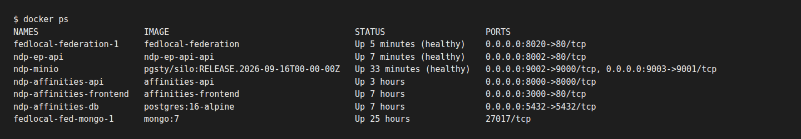

---

<!-- _class: imgslide -->

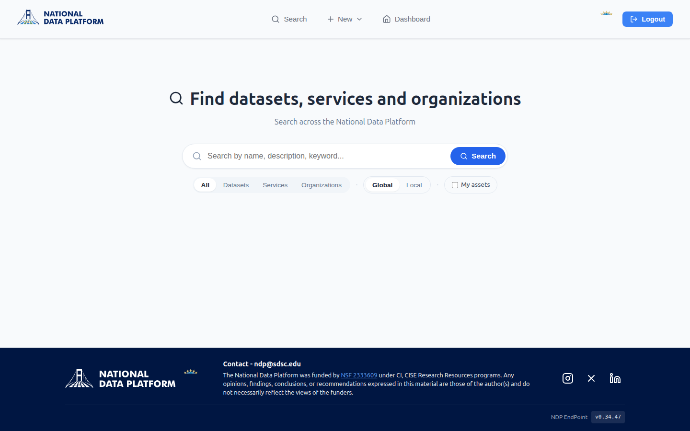

---

# Step 2 — Identity and permissions
### A user signs in and gets a role

---

## Bootstrap the first admin

The Endpoint has **no user store** — identity and roles come from **AAI (Keycloak)**.
How the first admin is created depends on the deployment:

- **🟢 NDP infrastructure (common case)** — registering the Endpoint with the
  Federation creates its Keycloak group `ndp_ep/ep-<config-id>`, with the
  **registering user as its administrator**. Holders of the platform-wide
  `ndp_admin` role are admins on every Endpoint.
- **🧪 Full stack (self-hosted)** — you assign the admin role yourself in your own
  Keycloak (next slide).

<!-- note: registration happens from the installer (it asks for the operator's
NDP access token) or on the platform's create-endpoint page, which hands out
the --config-id command. The Federation reads the user id from that token. -->

---

## Bootstrap the first admin — full stack

Self-hosted only. Granting roles from the EP UI or the AAI API requires an
existing admin, so the first one is set directly in Keycloak:

1. Create the user and set a password (appendix *Creating a user — Keycloak*).
2. Assign the realm role **`ndp_admin`** (platform-wide), or
   **`group:<G>:admin`** for this Endpoint only — `<G>` is an entry of
   `GROUP_NAMES` (e.g. `ndp_ep/ep-<config-id>`) or `AFFINITIES_EP_UUID`.

The user signs in again to get a token that carries the role.

---

## Where users come from (AAI)

Depends on the deployment:

- **🟢 NDP infrastructure (common case)** — users are existing
  **nationaldataplatform.org** accounts. You do not create them.
- **🧪 Full stack (self-hosted)** — create them in your own **Keycloak**
  → see appendix *Creating a user — Keycloak*.

Signing in: **paste an NDP access token**, or **username and password**.

> A user alone **cannot publish anything yet** — they still need a **role**.

---

## Requesting access (user)

On a registered Endpoint only members of its group (and `ndp_admin`) get in.
Anyone else is refused at sign-in and offered **Request access to this
Endpoint**, with an optional **justification**.

> Requires `ENABLE_ACCESS_REQUESTS=True` and a MongoDB; the installer provides
> one when you answer yes to *Enable access requests?*.

<!-- note: a user who can already enter but has no role does not see this
form; an admin gives them a role outside the Endpoint (AAI API, appendix). -->

---

<!-- _class: imgslide -->

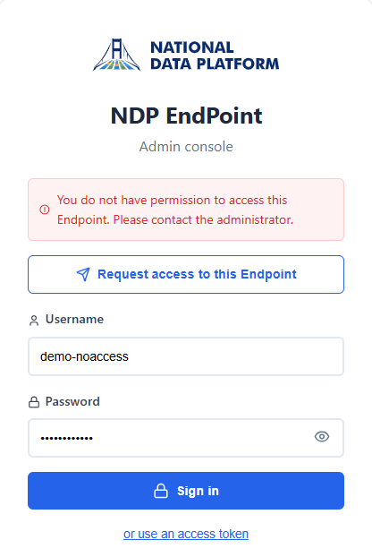

---

## Approving access (admin)

On the **Access Requests** page, an admin reviews pending requests and
**approves** each as **Viewer** (preselected), **Writer** or **Admin** — or
**rejects** it, optionally with notes.

Approval uses the admin's own token on the AAI: it adds the user to the
**first `GROUP_NAMES` entry** (or `AFFINITIES_EP_UUID` when `GROUP_NAMES` is
empty) and, for Writer or Admin, assigns that role on the group.

> The user signs in again to pick up the new role.

---

<!-- _class: imgslide -->

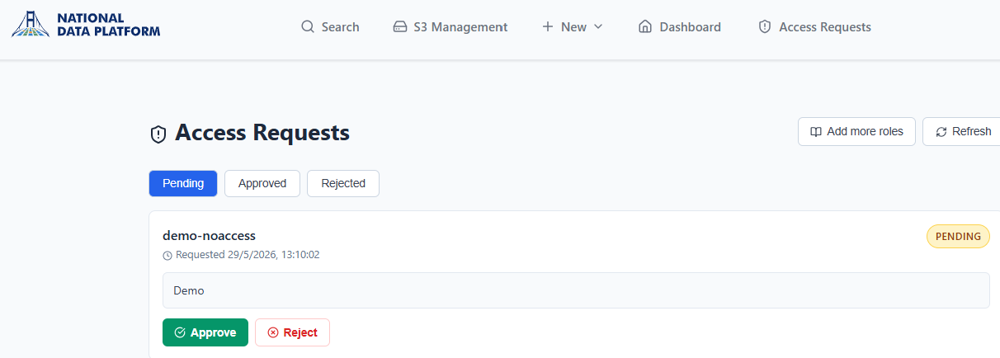

---

## The three roles

Roles come from **AAI** and are hierarchical (each tier includes the ones below):

| Role | Can do |
|---|---|
| 👁️ **Viewer** | Search and browse. **Read-only.** |
| ✏️ **Writer** | The above **+ create, edit, delete and publish** catalog items, and **S3 storage**. |
| 🛠️ **Admin** | All of the above **+ Dashboard** and **Access Requests**. |

Platform-wide: `ndp_viewer`, `ndp_writer`, `ndp_admin`. One Endpoint:
`group:<G>:<tier>`. The AAI's **editor** role counts as **writer**.

> With no role, a user who got in can search and browse — nothing else.

<!-- note: this is the permission model; it reappears live in Step 3. Search
and resource reads need no role; the viewer tier adds the Pelican read routes. -->

---

# Step 3 — The Endpoint in action
### Search, publish and manage from the web

---

## Search — the landing page

The home page is **Search**, available to **every signed-in user**, with or
without a role. Type **free text** to search.

Results expand to show description, tags, license, version, geographic
extent (on a map, when present) and the dataset's **resources**.

---

## Search — options

- **Category** — All · Datasets · Services · Organizations
- **Catalog** — **Global** (default, the NDP global catalog) or **Local**
  (this Endpoint's catalog; an error when it has none)
- **My assets** checkbox — only items you created (they carry a **Yours** badge)
- **Show N resource & metadata** — expands a result card
- From an organization card, list that organization's datasets
- On your own items in the Local catalog: **Delete**, and **Publish** for
  datasets (sends them to the platform's staging catalog, Pre-CKAN)

---

<!-- _class: imgslide -->

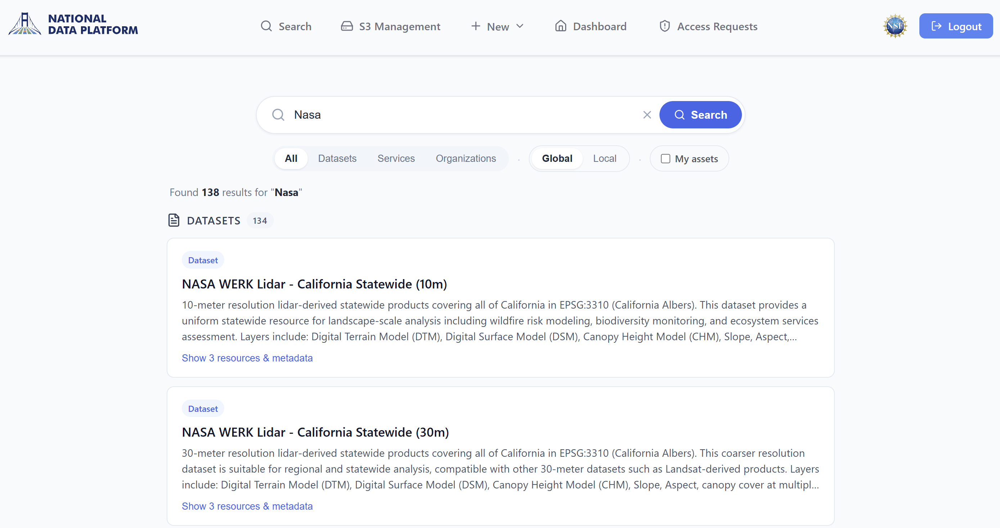

---

## The "+ New" menu

Available to **writers and admins**. Each entry appears only when the Endpoint
has what it needs:

| Entry | What it is | Shown when |
|---|---|---|
| **Organization** · **Dataset** · **Service** | Catalog entries | a local catalog |
| **Kafka topic** | Streaming data flow | Kafka enabled |
| **URL resource** | Link to a file or service | a local catalog |
| **S3 storage** | Buckets and objects page | S3 enabled |
| **S3 resource** | Object in S3-compatible storage | S3 + a local catalog |

> A default install (no local catalog, S3 or Kafka) shows no "+ New" menu.
> Navigation bar: **Search**, **+ New**, **Dashboard** and **Access Requests**
> (admins; the latter when enabled), **Logout**.

<!-- note: the next slides list each form. Field names are the API's; the
web form shows the required ones and some optional ones, and the rest are
set through the API or the Python library. -->

---

## "+ New" — Organization

A top-level **group** that owns datasets.

- **`name`** — Unique ID of the organization, used in URLs.
  *Example:* `atmospheric-research`
- **`title`** — Human-readable display title shown across the UI.
  *Example:* `Atmospheric Research Lab`
- **`description`** *(opt.)* — Free-text description.
  *Example:* `Group publishing radar and atmospheric datasets for research.`

---

## "+ New" — Dataset (required)

A logical container of related **resources**, owned by an organization.
Web form: **+ New → Dataset**, submitted with **Register dataset**.

- **`name`** — Unique slug (lowercase letters, digits, `_`, `-`).
  *Example:* `nexrad-reflectivity-2025`
- **`title`** — Human-readable title displayed on the dataset page.
  *Example:* `NEXRAD reflectivity composites, 2025`
- **`owner_org`** (*Organization*, a list in the form) — the organization that owns the dataset (must already exist).
  *Example:* `atmospheric-research`

---

## "+ New" — Dataset (optional, 1/2)

In the web form:

- **`notes`** (*Description*) — Longer description.
  *Example:* `Hourly NEXRAD Level-II reflectivity composites over CONUS, 2025.`
- **`private`** *(default `false`)* — Only visible to members of the owning organization.
- **`extras`** (*Additional metadata*) — Key/value pairs.
  *Example:* `{"region": "CONUS", "instrument": "NEXRAD"}`
- **Publish after creation** *(checkbox)* — also sends the new dataset to the
  staging catalog (Pre-CKAN), pending approval.

---

## "+ New" — Dataset (optional, 2/2)

- **`resources`** — Files or URLs attached at creation; the form takes URL,
  name, format and description for each.
  *Example:* `[{"url": "https://data.example.org/radar/2025-01.nc", "name": "jan-2025", "format": "NetCDF"}]`

Not in the web form — API (`POST /dataset`) and Python library only:

- **`tags`** — *Example:* `["radar", "nexrad", "2025"]`
- **`groups`** — *Example:* `["weather", "remote-sensing"]`
- **`license_id`** — License identifier. *Example:* `cc-by`
- **`version`** — Free-text version label. *Example:* `v1.2.0`

---

<!-- _class: imgslide -->

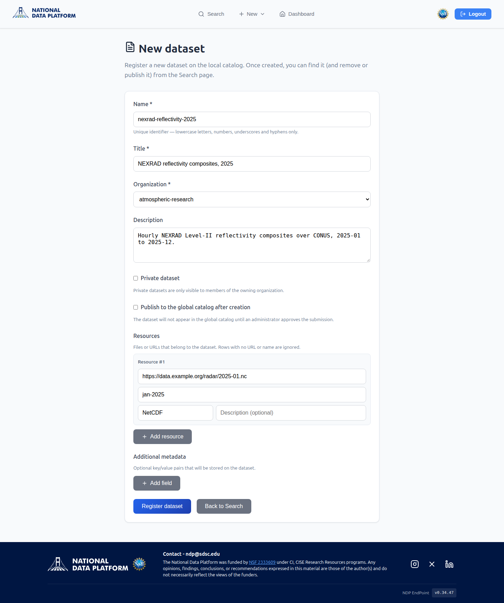

---

## Find the new dataset

On **Search**, choose the **Local** catalog and search for it (e.g. `nexrad`).

- Your own result carries the **Yours** badge.
- **Show N resource & metadata** expands the card.
- **Publish** sends it to the staging catalog; **Delete** removes it.

---

<!-- _class: imgslide -->

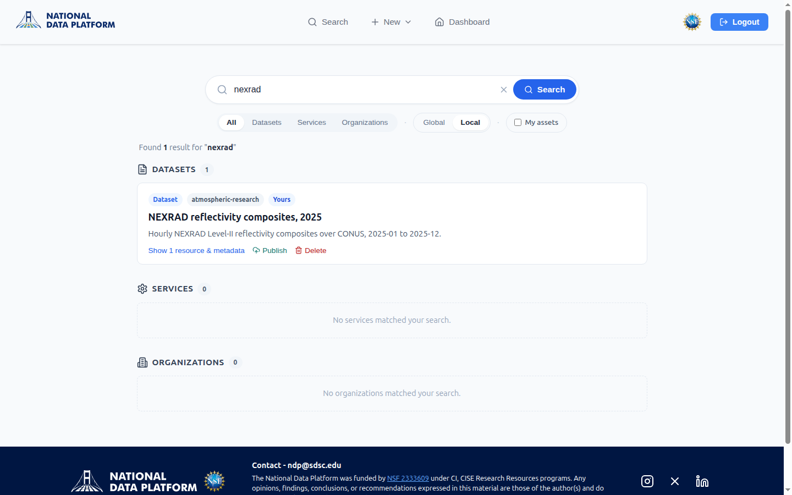

---

## "+ New" — Service (required)

A network-accessible **service** (REST API, web app, etc.), always under the `services` organization.

- **`service_name`** — Unique service name (1–100 chars).
  *Example:* `radar-stats-api`
- **`service_title`** — Display title (1–200 chars).
  *Example:* `Radar Statistics API`
- **`owner_org`** — **Must be `services`**; the web form sets it for you.
- **`service_url`** — URL where the service is reachable (`http(s)://…`).
  *Example:* `https://api.atmospheric-research.org/radar/stats`

---

## "+ New" — Service — `service_type` *(optional)*

What kind of service this is — used by the UI to label it.
The form offers three options plus **Other…** for free text (≤ 50 chars).

- **API** — programmatic interface (REST/HTTP, GraphQL, gRPC…) called by code.
- **UI** — human-facing interface (web app, dashboard, viewer…) opened in a browser.
- **Trigger** — event source / scheduled job (webhook, cron, producer…).
- **Other…** — any custom free-text value.

---

## "+ New" — Service (other optional)

- **`notes`** (*Description*) — Description or additional notes.
  *Example:* `RESTful API exposing aggregated reflectivity statistics.`
- **`health_check_url`** — URL of a health endpoint (`http(s)://…`).
  *Example:* `https://api.atmospheric-research.org/radar/stats/health`
- **`documentation_url`** — URL to the service documentation (`http(s)://…`).
  *Example:* `https://docs.atmospheric-research.org/radar-stats`
- **`extras`** (*Additional metadata*) — Key/value pairs.
  *Example:* `{"version": "2.1.0", "requires_auth": "true"}`

> Callers reach the service through `<endpoint-url>/services/redirect/<name>`;
> `requires_auth` set to true makes the Endpoint require a token first.

---

## "+ New" — URL resource (required)

A **link to a file or service**, registered in the local catalog.

- **`resource_name`** — Unique slug (lowercase letters, digits, `_`, `-`).
  *Example:* `radar-jan-2025`
- **`resource_title`** — Display title.
  *Example:* `Radar reflectivity — January 2025`
- **`owner_org`** — Organization that owns the resource.
  *Example:* `atmospheric-research`
- **`resource_url`** — URL of the file or service (must start with `http(s)://`).
  *Example:* `https://data.example.org/nexrad/2025-01.nc`

---

## "+ New" — URL resource (`file_type` & processing)

- **`file_type`** *(web form)* — `CSV`, `TXT`, `JSON`, `NetCDF`, `stream`;
  the API also accepts a custom value.
  *Example:* `CSV`
- **`processing`** *(API / Python only; type-specific)* — how to read the file:
  - **CSV:** `{"delimiter": ",", "header_line": 1, "start_line": 2}`
  - **JSON:** `{"data_key": "results"}`
  - **NetCDF:** `{"group": "/radar"}`

---

## "+ New" — URL resource (other optional)

- **`extras`** (*Additional metadata*) — Key/value pairs (string values).
  *Example:* `{"region": "CONUS", "cadence": "1h"}`

API and Python library only:

- **`mapping`** — Which fields to expose and how to rename them.
  *Example:* `{"refl": "reflectivity_dBZ", "ts": "timestamp"}`
- **`notes`** — Additional notes about the resource.
  *Example:* `Hourly NetCDF files; missing values flagged with -9999.`

---

## "+ New" — S3 resource (identification)

An **object in S3-compatible storage**, registered in the local catalog.

- **`resource_name`** — Unique slug (lowercase letters, digits, `_`, `-`).
  *Example:* `radar-archive-2025`
- **`resource_title`** — Display title.
  *Example:* `NEXRAD radar archive, 2025`
- **`owner_org`** — Organization ID that owns the resource.
  *Example:* `atmospheric-research`

---

## "+ New" — S3 resource (S3 details)

- **`resource_s3`** — Location of the object (`s3://bucket/path`, or `http(s)://…`).
  *Example:* `s3://nexrad-archive/2025/`
- **`notes`** *(opt., default empty; form: Description)* — Notes about the resource.
  *Example:* `Annual archive of NEXRAD Level-II composites, partitioned by month.`
- **`extras`** *(opt.; form: Additional metadata)* — Key/value pairs (string values).
  *Example:* `{"format": "NetCDF", "size_GB": "480"}`

---

## "+ New" — Kafka topic (required)

A **streaming data flow** registered as a dataset in the local catalog.

- **`dataset_name`** — Unique slug (lowercase letters, digits, `_`, `-`).
  *Example:* `nexrad-live`
- **`dataset_title`** — Display title.
  *Example:* `NEXRAD radar — live stream`
- **`owner_org`** — Organization that owns the dataset.
  *Example:* `atmospheric-research`

---

## "+ New" — Kafka topic (broker)

Point at the broker and the topic — all three required.

- **`kafka_topic`** — Kafka topic name.
  *Example:* `nexrad.live`
- **`kafka_host`** — Kafka broker host.
  *Example:* `kafka.atmospheric-research.org`
- **`kafka_port`** — Broker port (1–65535).
  *Example:* `9092`

---

## "+ New" — Kafka topic (optional)

- **`dataset_description`** (*Description*) — Description of the stream.
  *Example:* `Live JSON feed of NEXRAD radar volume scans, ~5 min cadence.`
- **`extras`** (*Additional metadata*) — Key/value pairs (string values).
  *Example:* `{"avg_msgs_per_min": "12"}`
- **`mapping`** *(API / Python only)* — Select/rename fields to send.
  *Example:* `{"refl": "reflectivity_dBZ", "ts": "timestamp"}`
- **`processing`** *(API / Python only)* — Processing config.
  *Example:* `{"data_key": "data", "info_key": "metadata"}`

---

## Storage management (S3) — writers only

Manage **buckets** and **objects** in S3-compatible storage from the UI
(**+ New → S3 storage**).

**Requires:**
- `S3_ENABLED=True` in `.env`, plus `S3_ENDPOINT`, `S3_ACCESS_KEY`, `S3_SECRET_KEY` (and optionally `S3_SECURE`, `S3_REGION`) — the installer writes them when you enable S3.
- **Writer or admin** role — the entry is hidden otherwise; every `/s3/*` API route answers `403` to other users.

---

<!-- _class: imgslide -->

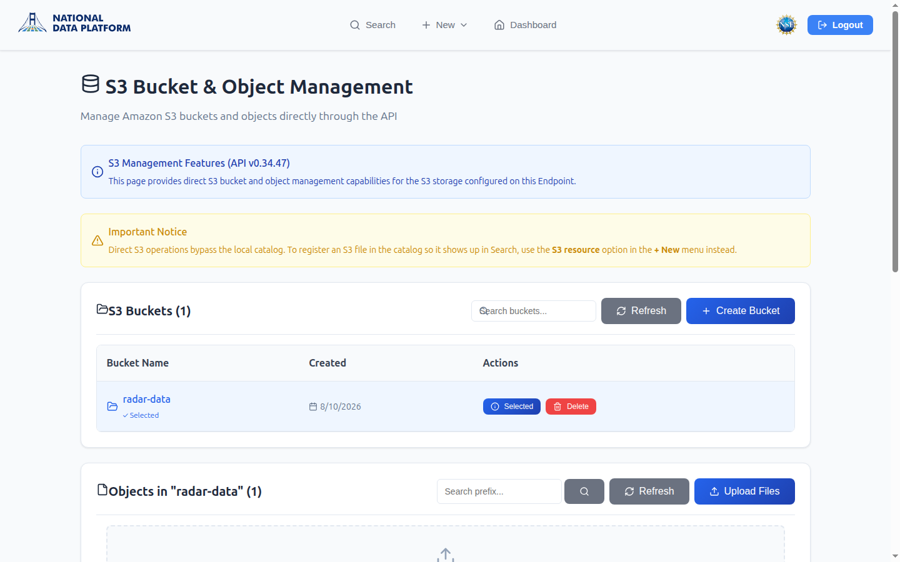

---

## S3 Management — buckets

A list view (Bucket Name · Created · Actions) with a filter to find buckets quickly.

- **Create** a bucket (name + region, default `us-east-1`).
- **List** all buckets with creation dates.
- **Filter** by name.
- **Select** a bucket to manage its objects.
- **Delete** a bucket (it must be empty).
- **Refresh** the list.

---

## S3 Management — objects

Select a bucket → manage its objects (Name · Size · Last Modified · Type).

- **Upload** files via drag-and-drop or the file picker.
- **List** objects in the bucket, and **search** by prefix.
- **Download** an object to your computer.
- **View** an object's **metadata**.
- **Generate a download link** — a presigned URL, valid for 1 hour, copied to the clipboard.
- **Delete** individual objects.

---

# Step 4 — Automate with Python
### The same operations, from code

<!-- note: for the non-dev audience, frame it as "for power users:
everything in the web can also be automated". -->

---

## The `ndp-ep` library

The Endpoint's operations are also available **from code** — its HTTP API
(`<endpoint-url>/docs`) or the `ndp-ep` Python library — for automation and
bulk loading.

```bash
pip install ndp-ep
```

> A separate project (`github.com/sci-ndp/ndp-ep-py`); the names shown are
> those of **ndp-ep 0.9.0**.

---

## Example: in a few lines

```python
from ndp_ep import APIClient

# 1. Connect with a token (or username= / password=)
# https only on a domain with a TLS certificate; a bare IP or localhost is http://
client = APIClient(base_url="http://<host>:8002", token="…")

# 2. List organizations
print(client.list_organizations(server="local"))

# 3. Create a dataset and search for it
client.register_general_dataset({"name": "measurements-2026",
    "title": "Measurements 2026", "owner_org": "my-org"})
print(client.search_datasets(["measurements"], server="local"))
```

<!-- note: base_url is <endpoint-url>, the web app's address without /ui/.
Other methods: register_url, register_s3_link, register_kafka_topic,
register_service, and the S3 bucket/object methods. The library has no
Publish method; that is POST <endpoint-url>/dataset/<id>/publish. -->

---

## Web and code: a unified interface

```
   Web (click)   ─┐
                  ├─►  the SAME Endpoint  ─►  the SAME catalog
   Python (code) ─┘
```

> The web interface and the library target the same Endpoint: **identical data and permissions.**

---

# Step 5 — Federation
### The Endpoint is registered and reports

---

## The Endpoint registers

Registration happens **at install time**: the installer (or the platform's
create-endpoint page) calls the Federation, which creates the Endpoint's
**Keycloak client and group**, a **staging-catalog token** and an
**Affinities** entry, and returns a **configuration id**.

The installer builds `.env` from that configuration. After that, the running
Endpoint's only call to the Federation is its **metrics report**.

---

<!-- _class: imgslide -->

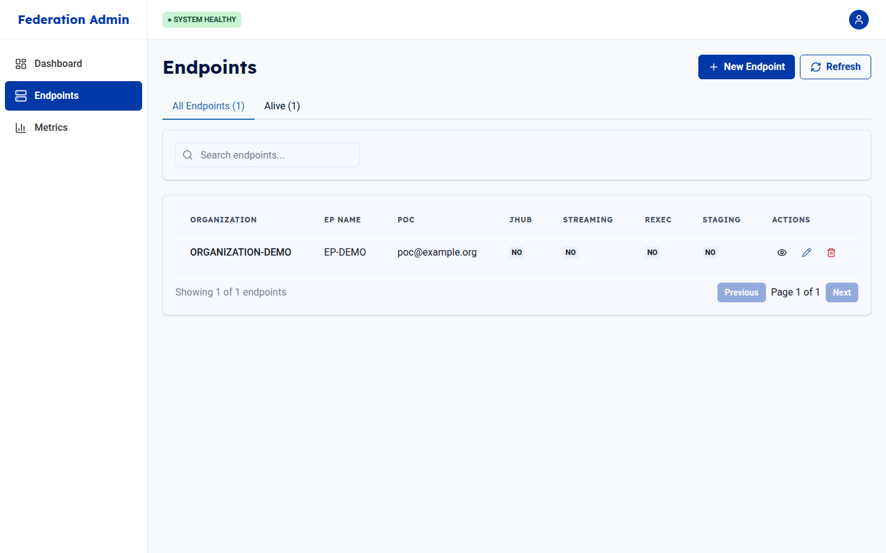

---

## Health and metrics

The Federation admin web app (`/ui/`) shows:

- **Dashboard** — total Endpoints, how many have JupyterHub, streaming or remote
  execution enabled, the number of metrics reports, system health and version.
- **Endpoints** — the registered Endpoints, with an **Alive** tab: those that
  reported in the last hour.
- **Metrics** — the reports received: CPU, memory, disk, datasets, time received.

---

<!-- _class: imgslide -->

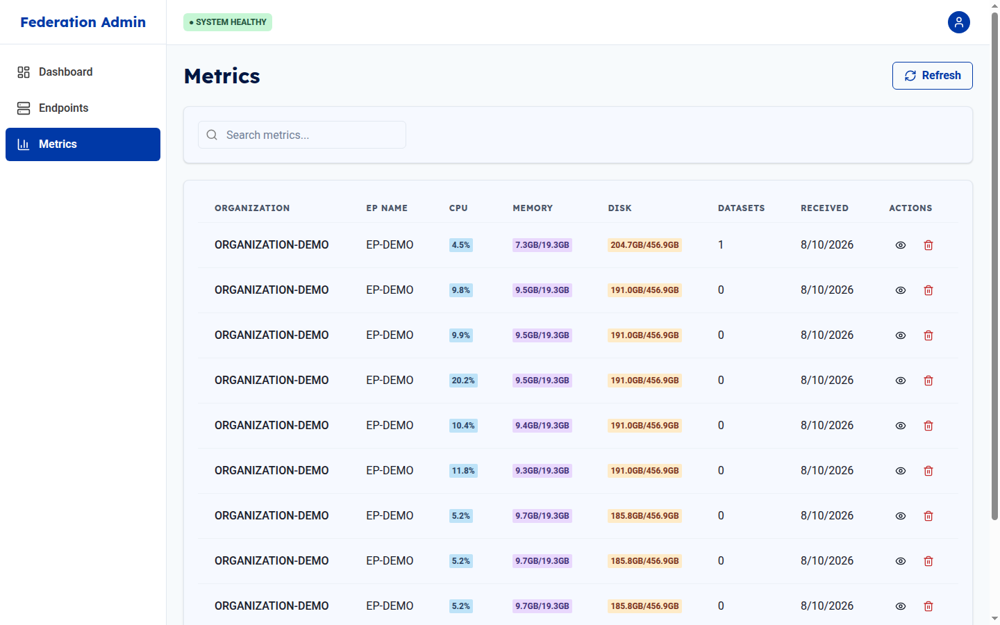

---

## What the Endpoint reports

At startup and then every `METRICS_INTERVAL_SECONDS` (default **55 min**), one
report per interval, **only when `IS_PUBLIC=True`**, posted to `METRICS_ENDPOINT`
(the installer writes `<federation-url>/metrics/`):

**Identity & version**
- `organization`, `ep_name`, `version` (EP API version), `public_ip`, `timestamp`.

**Catalog activity**
- `num_datasets`, `num_services`, `services` (service titles); `0`/empty without a local catalog.

**Host load**
- `cpu` (%), `memory` (`used/total GB`), `disk` (`used/total GB`).

---

## What the Endpoint reports — infrastructure flags

- `jupyterlab_enabled` *(if true: `jupyterlab_url`)*
- `kafka_enabled` *(if true: `kafka_host`, `kafka_port`)*
- `s3_enabled`, `pre_ckan_enabled`
- `ckan_api_key_configured` (a boolean, never the key) and `ckan_url` *(if set)*
- `netbird_enabled`, `netbird_ip`, `netbird_group` *(only if set)*

> No tokens, user data or dataset content are sent. The report is sent without
> authentication; if it fails, it is logged and not retried, and the Endpoint
> keeps working. With `IS_PUBLIC=False` (the installer's value without a
> registration) it is only logged.

---

## 🔒 Bonus — NetBird

**[NetBird](https://netbird.io)** — open-source mesh VPN built on **WireGuard**.

- Each machine joins a private virtual network and gets a **private IP**.
- Traffic flows **encrypted** between authorized peers; access is restricted by policy.
- Services can be reached over the private network instead of public ports.

**For NDP:** when the Endpoint and the platform components run on different
machines, NetBird connects them over a single private overlay. The Endpoint does
not use NetBird itself; `NETBIRD_*` values set by the host's operator are only
added to its metrics report.

---

## Resources

- **Endpoint:** web `<endpoint-url>/ui/` · API docs `<endpoint-url>/docs`
- **Installer:** `install/install.sh` · docs: `install/README.md`, `docs/`
- **Federation:** `https://federation.ndp.utah.edu` (production) · local `http://<host>:8020/ui/`
- **Affinities:** local web app `http://<host>:3000`
- **Python library:** `pip install ndp-ep` · PyPI: `ndp-ep`
- **Repos:** `national-data-platform/ep-api`, `sci-ndp/ndp-federation`,
  `sci-ndp/ndp-affinities`, `sci-ndp/ndp-keycloak-aai-old`, `sci-ndp/ndp-ep-py`

---

# Appendix

---

## Obtaining an Affinities UID (`AFFINITIES_EP_UUID`)

Needed only for the **Affinities integration** (`AFFINITIES_ENABLED=True`) or
for roles/groups keyed on `AFFINITIES_EP_UUID`. A registered Endpoint is added
to Affinities by the Federation; the installer does not read that UID.

In the Affinities web app (`http://localhost:3000`, or your Affinities URL):
**Endpoints → Add Endpoint**, fill **Kind** (`ndp-ep`), **URL**, optional
**Metadata (JSON)**, then **Save**. The new row's **UID** is the value.

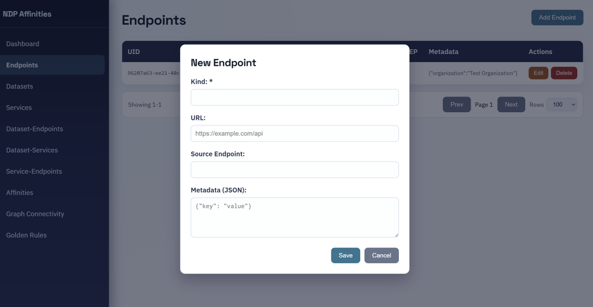

---

## Obtaining an Affinities UID — Affinities API

**Via the Affinities API** (`http://localhost:8000`, Swagger at `/docs`):

```bash
# list endpoints and copy your uid
curl http://localhost:8000/ep

# or register this endpoint; the response includes "uid"
curl -X POST http://localhost:8000/ep -H 'Content-Type: application/json' \
  -d '{"kind":"ndp-ep","url":"https://<your-ndp-ep>","metadata":{"name":"My EP"}}'
```

The returned `uid` is your `AFFINITIES_EP_UUID`. Use paths without a trailing slash.

---

## Creating a user — Keycloak

In the Keycloak admin console, in the AAI's realm:

1. **Users → Add user** — set **Username** and the required profile fields (email, first/last name), then **Create**.
2. Open the user → **Credentials → Set password** — turn **Temporary** off, then **Save**.

---

## Assigning groups & roles — AAI API

After the user exists, assign groups/roles via the **AAI API** (base URL: scheme
and host of `AUTH_API_URL`; the caller must already be an admin):

```bash
# authenticate as an admin
TOKEN=$(curl -s -X POST "$AAI/user/login" -H 'Content-Type: application/json' \
  -d '{"username":"<admin>","password":"<pass>"}' | jq -r .access_token)

# join the Endpoint's group
curl -s -X POST "$AAI/group/add-user" -H "Authorization: Bearer $TOKEN" \
  -H 'Content-Type: application/json' \
  -d '{"group_name":"<GROUP>","username":"<user>"}'
```

`<GROUP>` is the Endpoint's group from `GROUP_NAMES` (`ndp_ep/ep-<config-id>`
on a registered Endpoint).

---

## Assigning groups & roles — AAI API (cont.)

Give a higher tier on that group (bare name: `writer` | `admin`):

```bash
curl -s -X POST "$AAI/role/assign" -H "Authorization: Bearer $TOKEN" \
  -H 'Content-Type: application/json' \
  -d '{"role_name":"writer","username":"<user>","group_name":"<GROUP>"}'
```

These are the same calls the Endpoint makes when an admin approves an access request.

> **First admin exception:** assign `ndp_admin` **directly in Keycloak** — no admin
> exists yet to call this API. The user must sign in again for new roles to take effect.

---

## Credentials the installer stores

- **From a Federation registration** — the staging-catalog URL and key
  (`PRE_CKAN_URL`, `PRE_CKAN_API_KEY`) go into `.env`.
- **CKAN installed by the installer** — the API token it mints, the CKAN URL
  and the sysadmin credentials go into `.env.install-state` (mode 600); a
  re-run reuses them instead of minting another token.
- **Backups** — every re-run first saves `.env` as `.env.backup.<timestamp>`.

`.env` and `.env.install-state` exist nowhere else: back them up. Remembered
settings stored in the Federation never include credentials.
