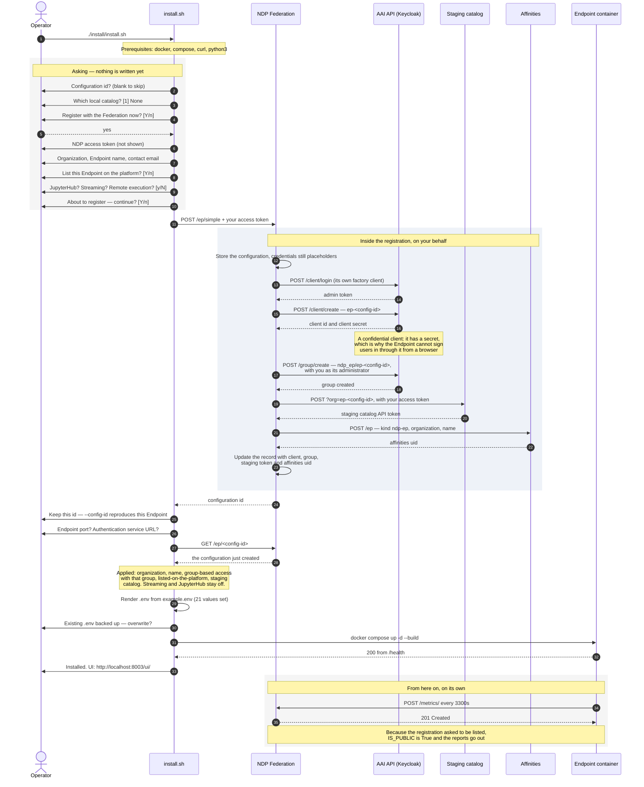

# Installing an Endpoint registered with the Federation

The same lightest install as the [standalone one](installing-standalone-no-catalog.md)
— no local catalog, every other answer left at its default — but **registered
with the NDP Federation**, which is what lists it on the platform.

```bash
./install/install.sh
```

Answer the prompts by pressing Enter, answer **yes** to *Register this Endpoint
with the Federation now?*, and paste your NDP access token when asked. You are
also asked for an organization, a name, a contact email, and whether to be
listed; the optional features (JupyterHub, streaming, remote execution) stay
off.

Registering happens **before** anything is installed: the configuration it
returns is what drives the rest of the install.

## The sequence

The Federation does most of the work, and it does it against three other
services. That is the part worth reading — the grey box below.



## What the registration created

Four things, in three different services, none of which exist for a standalone
install:

| What | Where | The Endpoint uses it |
|---|---|---|
| A configuration record, keyed by the configuration id | Federation | Yes — re-runs read it with `--config-id` |
| A Keycloak client `ep-<config-id>`, **confidential** | Identity provider | **No.** Sign-in through it does not work yet; see [configuration.md](../configuration.md) |
| A group `ndp_ep/ep-<config-id>`, with you as administrator | Identity provider | Yes — it lands in `GROUP_NAMES` and gates every write |
| An API token for the staging catalog | Staging CKAN | Yes — `PRE_CKAN_API_KEY` |
| An entry describing this Endpoint | Affinities | Not directly; it is what makes the Endpoint discoverable |

## The `.env` it produces

Only the values that differ from the [standalone install](installing-standalone-no-catalog.md)
are listed; everything else is identical.

| Variable | Value | Where it comes from |
|---|---|---|
| `ORGANIZATION`, `EP_NAME` | `my-org-reg`, `my-ep-reg` | The answers, stored in the registration |
| `ENABLE_GROUP_BASED_ACCESS` | `True` | Set because the registration produced a group |
| `GROUP_NAMES` | `ndp_ep/ep-<config-id>` | The group created for this Endpoint |
| `IS_PUBLIC` | `True` | "List this Endpoint on the platform" — this is what lets the metrics be posted |
| `PRE_CKAN_ENABLED` | `True` | Set because the registration returned a staging URL and token |
| `PRE_CKAN_URL`, `PRE_CKAN_API_KEY` | the platform's catalog2, and the minted token | The registration |

`OIDC_ENABLED` stays `False` even though a client was created for this
Endpoint: its tokens carry no `sub` claim, which is what the authentication
service looks the user up by, so sign-in through it fails after a successful
login. The installer does not offer it.

## What this Endpoint does

Everything the standalone one does — authenticate users, search the platform's
global catalog, serve its UI, answer `/health` and `/ready` — plus:

- **It is listed on the platform.** Metrics go out every 3300 seconds and the
  Federation records them, so the Endpoint shows as active.
- **Writes are gated by the group.** With `ENABLE_GROUP_BASED_ACCESS=True`, a
  user needs to be in `ndp_ep/ep-<config-id>` to write. You are its
  administrator, but a token minted **before** the group existed does not carry
  it — copy a fresh one from your user panel after registering.

It still stores nothing: with no local catalog, the registration, update,
delete and resource routes are not mounted, so there is nothing to write to
locally and nothing to publish to the staging catalog either, even though the
credentials for it are configured.
