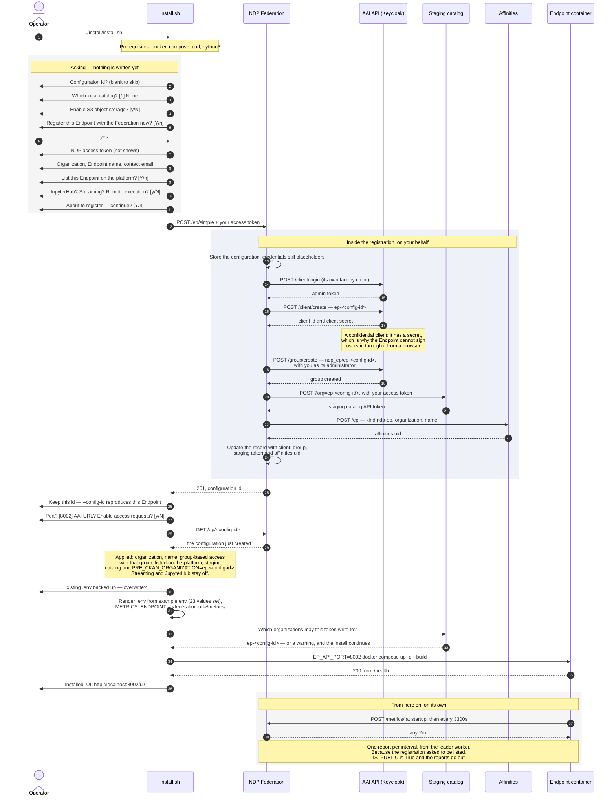

# Installing an Endpoint registered with the Federation

The same lightest install as the [standalone one](installing-standalone-no-catalog.md)
— no local catalog, no S3, no access requests — but **registered with the NDP
Federation**, which is what lists it on the platform.

```bash
./install/install.sh
```

Press Enter at the configuration-id prompt, accept the defaults for the
catalog and S3, answer **yes** (the default) to *Register this Endpoint with
the Federation now?*, and paste your NDP access token when asked. You are
then asked for an organization, a name, a contact email and whether to be
listed on the platform; the optional features (JupyterHub, streaming, remote
execution) stay off. The examples below use `my-org` and `my-ep` as the
answers.

Registering happens **before** anything is installed: the configuration it
returns is what drives the rest of the install. There is no unattended way to
register; `--yes` skips every prompt, including this one.

## The sequence

The Federation does most of the work, and it does it against three other
services. That is the part worth reading — the shaded box below.


```mermaid
sequenceDiagram
    autonumber
    actor Operator
    participant Installer as install.sh
    participant Fed as NDP Federation
    participant AAI as AAI API (Keycloak)
    participant Pre as Staging catalog
    participant Aff as Affinities
    participant EP as Endpoint container

    Operator->>Installer: ./install/install.sh
    Note over Installer: Prerequisites: docker, compose, curl, python3

    rect rgb(245, 245, 245)
    Note over Operator,Installer: Asking — nothing is written yet
    Installer->>Operator: Configuration id? (blank to skip)
    Installer->>Operator: Which local catalog? [1] None
    Installer->>Operator: Enable S3 object storage? [y/N]
    Installer->>Operator: Register this Endpoint with the Federation now? [Y/n]
    Operator-->>Installer: yes
    Installer->>Operator: NDP access token (not shown)
    Installer->>Operator: Organization, Endpoint name, contact email
    Installer->>Operator: List this Endpoint on the platform? [Y/n]
    Installer->>Operator: JupyterHub? Streaming? Remote execution? [y/N]
    Installer->>Operator: About to register — continue? [Y/n]
    end

    Installer->>Fed: POST /ep/simple + your access token

    rect rgb(238, 242, 248)
    Note over Fed,Aff: Inside the registration, on your behalf
    Fed->>Fed: Store the configuration, credentials still placeholders
    Fed->>AAI: POST /client/login (its own factory client)
    AAI-->>Fed: admin token
    Fed->>AAI: POST /client/create — ep-<config-id>
    AAI-->>Fed: client id and client secret
    Note over AAI: A confidential client: it has a secret,<br/>which is why the Endpoint cannot sign<br/>users in through it from a browser
    Fed->>AAI: POST /group/create — ndp_ep/ep-<config-id>,<br/>with you as its administrator
    AAI-->>Fed: group created
    Fed->>Pre: POST ?org=ep-<config-id>, with your access token
    Pre-->>Fed: staging catalog API token
    Fed->>Aff: POST /ep — kind ndp-ep, organization, name
    Aff-->>Fed: affinities uid
    Fed->>Fed: Update the record with client, group,<br/>staging token and affinities uid
    end

    Fed-->>Installer: 201, configuration id
    Installer->>Operator: Keep this id — --config-id reproduces this Endpoint

    Installer->>Operator: Port? [8002] AAI URL? Enable access requests? [y/N]

    Installer->>Fed: GET /ep/<config-id>
    Fed-->>Installer: the configuration just created
    Note over Installer: Applied: organization, name, group-based access<br/>with that group, listed-on-the-platform, staging<br/>catalog and PRE_CKAN_ORGANIZATION=ep-<config-id>.<br/>Streaming and JupyterHub stay off.

    Installer->>Operator: Existing .env backed up — overwrite?
    Installer->>Installer: Render .env from example.env (23 values set),<br/>METRICS_ENDPOINT = <federation-url>/metrics/
    Installer->>Pre: Which organizations may this token write to?
    Pre-->>Installer: ep-<config-id> — or a warning, and the install continues
    Installer->>EP: EP_API_PORT=8002 docker compose up -d --build
    EP-->>Installer: 200 from /health
    Installer->>Operator: Installed. UI: http://localhost:8002/ui/

    rect rgb(245, 245, 245)
    Note over EP,Fed: From here on, on its own
    EP->>Fed: POST /metrics/ at startup, then every 3300s
    Fed-->>EP: any 2xx
    Note over EP,Fed: One report per interval, from the leader worker.<br/>Because the registration asked to be listed,<br/>IS_PUBLIC is True and the reports go out
    end
```

The *About to register* confirmation is asked once; if the Federation answers
400 (usually a name already taken), the installer asks for another name and
sends the registration again without asking the rest. A 401, 422, 502/503/504
or an unreachable Federation stops the install; see
[federation-and-metrics.md](../architecture/federation-and-metrics.md#12-registering--post-epsimple)
for each case.

There is no remembered-settings offer in this run: it is made only when a
configuration id is known at the first prompt.

## What the registration created

Five things, in four different services, none of which exist for a standalone
install:

| What | Where | The Endpoint uses it |
|---|---|---|
| A configuration record, keyed by the configuration id | Federation | Yes — re-runs read it with `--config-id` |
| A Keycloak client `ep-<config-id>`, **confidential** | Identity provider | **No.** Sign-in through it does not work; see [configuration.md](../configuration.md) |
| A group `ndp_ep/ep-<config-id>`, with you as administrator | Identity provider | Yes — it lands in `GROUP_NAMES`, decides who may enter, and is the group an approved access request grants (since 0.34.46) |
| An API token for the staging catalog, for organization `ep-<config-id>` | Staging CKAN | Yes — `PRE_CKAN_API_KEY`, with `PRE_CKAN_ORGANIZATION=ep-<config-id>` |
| An entry describing this Endpoint | Affinities | No — the uid is not read and `AFFINITIES_EP_UUID` stays empty |

## The `.env` it produces

Only the values that differ from the [standalone install](installing-standalone-no-catalog.md)
are listed; everything else is identical. The 23 values set are the 18
variables the standalone install sets plus `ENABLE_GROUP_BASED_ACCESS`,
`GROUP_NAMES`, `PRE_CKAN_URL`, `PRE_CKAN_API_KEY` and
`PRE_CKAN_ORGANIZATION`.

| Variable | Value | Where it comes from |
|---|---|---|
| `ORGANIZATION`, `EP_NAME` | `my-org`, `my-ep` | The answers, stored in the registration |
| `ENABLE_GROUP_BASED_ACCESS` | `True` | Set because the registration produced a group |
| `GROUP_NAMES` | `ndp_ep/ep-<config-id>` | The group created for this Endpoint |
| `IS_PUBLIC` | `True` | "List this Endpoint on the platform" — this is what lets the metrics be posted |
| `PRE_CKAN_ENABLED` | `True` | Set because the registration returned a staging URL and token |
| `PRE_CKAN_URL`, `PRE_CKAN_API_KEY` | the platform's staging catalog, and the minted token | The registration |
| `PRE_CKAN_ORGANIZATION` | `ep-<config-id>` | Derived from the configuration id: the organization the token was minted for |
| `METRICS_ENDPOINT` | `<federation-url>/metrics/` | The Federation this run registered with (the same line as in a standalone install) |

`OIDC_ENABLED` stays `False` even though a client was created for this
Endpoint: its tokens carry no `sub` claim, which is what the authentication
service looks the user up by, so sign-in through it fails after a successful
login. The installer does not offer it.

## What this Endpoint does

Everything the standalone one does — authenticate users, search the platform's
global catalog, serve its UI, answer `/health` and `/ready` — plus:

- **It is listed on the platform.** The first report goes out when the
  Endpoint starts and then one every 3300 seconds; the Federation records
  them, so the Endpoint shows as active.
- **Entry is gated by the group.** With `ENABLE_GROUP_BASED_ACCESS=True`, a
  user must be in `ndp_ep/ep-<config-id>` (or hold the platform-wide
  `ndp_admin` role) to enter the Endpoint at all; the UI refuses anyone else
  at sign-in. **Writes** also need a writer or admin role. You are the group's
  administrator, but a token minted **before** the group existed does not
  carry it — copy a fresh one from your user panel after registering.

It still stores nothing: with no local catalog, the registration, update,
delete and resource routes are not mounted, so there is nothing to write to
locally and nothing to publish to the staging catalog either, even though the
credentials for it are configured.
