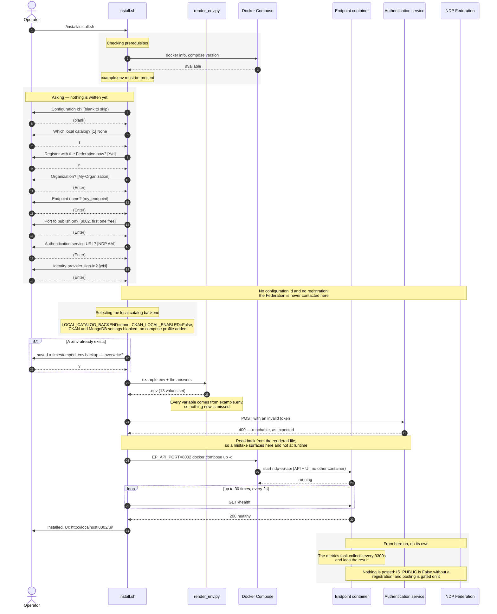

# Installing a standalone Endpoint with no catalog

The lightest install there is, and the one to start from:

- **no Federation registration** — the Endpoint is not listed on the platform,
- **no local catalog** — no MongoDB, no CKAN, nothing stored here,
- **every answer left at its default**.

```bash
./install/install.sh
```

Answer the prompts by pressing Enter, except *Register this Endpoint with the
Federation now?*, which is answered `n`. The unattended equivalent is:

```bash
./install/install.sh --backend none --yes
```

## The sequence



## The `.env` it produces

`.env` is rendered from `example.env`, so it keeps every comment and every
variable the Endpoint documents. Stripped of comments, this is the whole file:

```ini
ROOT_PATH=
ORGANIZATION=My-Organization
EP_NAME=my_endpoint
IS_PUBLIC=False
METRICS_INTERVAL_SECONDS=3300
METRICS_ENDPOINT=https://federation.ndp.utah.edu/metrics/
NETBIRD_ENABLED=False
NETBIRD_IP=
NETBIRD_GROUP=
ENABLE_GROUP_BASED_ACCESS=False
GROUP_NAMES=
ENABLE_ACCESS_REQUESTS=False
ACCESS_REQUESTS_COLLECTION=access_requests
LOCAL_CATALOG_BACKEND=none
CKAN_LOCAL_ENABLED=False
CKAN_URL=
CKAN_API_KEY=
CKAN_VERIFY_SSL=True
MONGODB_CONNECTION_STRING=
MONGODB_DATABASE=ndp_local_catalog
PRE_CKAN_ENABLED=False
PRE_CKAN_URL=
PRE_CKAN_API_KEY=
PRE_CKAN_VERIFY_SSL=True
PRE_CKAN_ORGANIZATION=
KAFKA_CONNECTION=False
KAFKA_HOST=kafka
KAFKA_PORT=9093
TEST_TOKEN=testing_token
AUTH_API_URL=https://idp.nationaldataplatform.org/temp/information
OIDC_ENABLED=False
USE_JUPYTERLAB=False
JUPYTER_URL=http://jupyterlab:8888
S3_ENABLED=False
S3_ENDPOINT=minio:9000
S3_ACCESS_KEY=minioadmin
S3_SECRET_KEY=minioadmin123
S3_SECURE=False
S3_REGION=us-east-1
PELICAN_ENABLED=False
PELICAN_FEDERATION_URL=
PELICAN_DIRECT_READS=False
REXEC_CONNECTION=False
REXEC_DEPLOYMENT_API_URL=
AFFINITIES_ENABLED=False
AFFINITIES_URL=
AFFINITIES_EP_UUID=
AFFINITIES_TIMEOUT=30
```

The values the installer set are the ones that differ from `example.env`'s
demo defaults:

| Variable | Value | Why |
|---|---|---|
| `ORGANIZATION`, `EP_NAME` | `My-Organization`, `my_endpoint` | The answers given at the prompt |
| `AUTH_API_URL` | NDP AAI | Where login tokens are validated |
| `LOCAL_CATALOG_BACKEND` | `none` | No local catalog |
| `CKAN_LOCAL_ENABLED` | `False` | Leaves the routes that write to a local catalog unmounted |
| `CKAN_URL`, `CKAN_API_KEY`, `MONGODB_CONNECTION_STRING` | empty | Nothing must point at a service that was not installed |
| `IS_PUBLIC` | `False` | No registration, so nothing is reported to the Federation |
| `KAFKA_CONNECTION`, `S3_ENABLED`, `USE_JUPYTERLAB`, `PELICAN_ENABLED`, `AFFINITIES_ENABLED`, `REXEC_CONNECTION`, `PRE_CKAN_ENABLED`, `OIDC_ENABLED` | `False` | `example.env` is a demo with every integration on; a fresh install provisions none of them |

Everything else is `example.env`'s documented default, untouched. One of those
defaults is worth knowing: **`TEST_TOKEN=testing_token`** is a development
convenience. Change it, or clear it, on anything reachable by others.

`METRICS_ENDPOINT` still points at the Federation, but it is never used:
posting is gated on `IS_PUBLIC`, which a registration is what turns on.

## What this Endpoint does, and does not

**It does**: authenticate users against the NDP AAI, search the platform's
global catalog, serve its UI at `/ui/`, answer `/health` and `/ready` and
redirect to services.

`/ready` reports the local catalog as `disabled`, not as down:

```json
{"status": "healthy",
 "checks": {"local_catalog": {"status": "disabled", "backend": "none"},
            "pre_ckan": {"status": "disabled"},
            "minio": {"status": "disabled"},
            "kafka": {"status": "disabled"}}}
```

**It does not**: store anything, or tell anyone about itself. The registration,
update, delete and resource routes are not mounted at all — they are absent
from `/docs` rather than failing when called — and `/search?server=local`
answers `400 Local CKAN is disabled and cannot be used`. Publishing to the
staging catalog is off too, since it travels through the same routes. Nothing
is posted to the Federation: the Endpoint never registered, so it is not
public, and metrics stay local to its logs.
