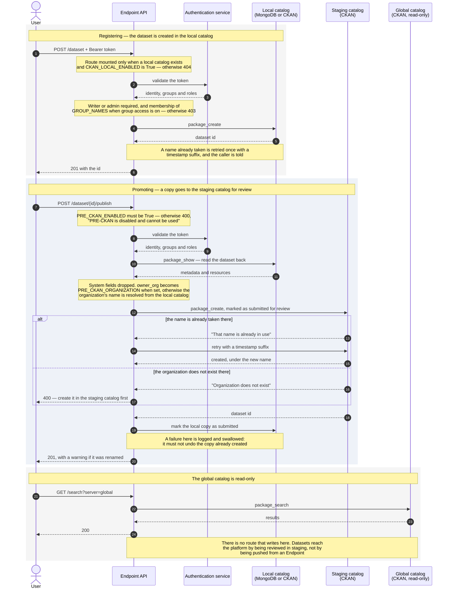

# Publishing a dataset

Where a dataset goes, who is asked for permission along the way, and which
switch stops it. Drawn against an Endpoint with everything switched on — a
local catalog and the staging catalog both configured — with each gate marked,
so the same picture explains an Endpoint where one of them is off.

The three catalogs are not three destinations to choose from. A dataset is
**registered** in the local catalog, **promoted** from there to the staging
catalog for review, and the **global** catalog is read-only: nothing is ever
published to it from an Endpoint.

## The sequence

## What stops it, and how you can tell

Each of these fails differently on purpose — the status code says which switch
is closed.

| Configuration | Registering locally | Promoting to staging |
|---|---|---|
| Everything on | Works | Works |
| `PRE_CKAN_ENABLED=False` | Works | **400** — "PRE-CKAN is disabled and cannot be used" |
| `CKAN_LOCAL_ENABLED=False` | **404** — the route is not mounted | **404** — same |
| `LOCAL_CATALOG_BACKEND=none` | **404** — nothing to write to | **404** |
| Group access on, user outside the group | **403** | **403** |
| User with no writer or admin role | **403** | **403** |

The two 404s surprise people: the routes are *absent* rather than answering an
error, so they do not appear in `/docs` either. That is deliberate — an
Endpoint should not advertise operations it cannot perform — but it means a
call gets the same answer as a typo in the path.

## What each install produces

The installer decides these switches for you:

| Install | Local catalog | Staging |
|---|---|---|
| No catalog, no registration | Nothing to register into — the routes are absent | Off: no URL, no credentials |
| No catalog, registered | Same | Configured, but unreachable through the absent routes |
| MongoDB or CKAN, no registration | Works | Off — the credentials come from a registration |
| MongoDB or CKAN, registered | Works | Works, with the token the registration minted |

The staging catalog's URL and API token are not something to fill in by hand:
the Federation mints that token during registration, using the operator's own
access token. An Endpoint that never registered has no way to obtain one.

`PRE_CKAN_ORGANIZATION` is a separate matter and is optional. It overrides the
`owner_org` of everything promoted, which is needed when the staging
credentials are tied to one organization. Left empty, the dataset keeps its own
organization, resolved to its name.

## Related

- [Installing a standalone Endpoint with no catalog](installing-standalone-no-catalog.md)
- [Installing an Endpoint registered with the Federation](installing-registered-no-catalog.md)
- [Roles and permissions](../roles-and-permissions.md) — who counts as a writer
- [Configuration reference](../configuration.md) — every switch named above
