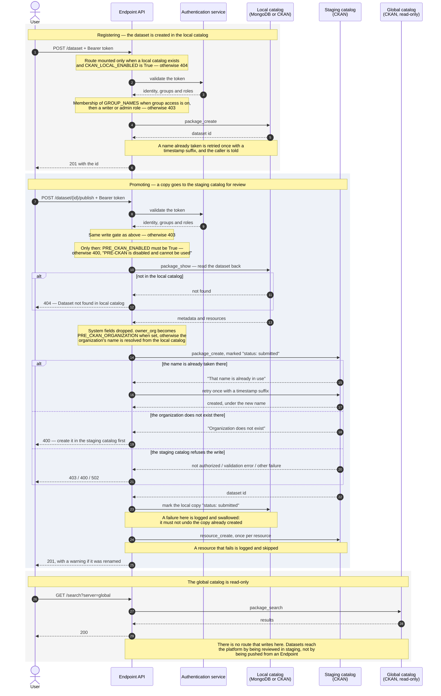

# Publishing a dataset

Where a dataset goes, who is asked for permission along the way, and which
switch stops it. Drawn against an Endpoint with everything switched on — a
local catalog and the staging catalog both configured — with each gate marked,
so the same picture explains an Endpoint where one of them is off.

The usual path is: a dataset is **registered** in the local catalog,
**promoted** from there to the staging catalog for review, and the **global**
catalog is read-only: nothing is ever published to it from an Endpoint. A
dataset can also be written to the staging catalog directly, without a local
copy (`POST /dataset?server=pre_ckan`, below).

## The sequence

```mermaid
sequenceDiagram
    autonumber
    actor User
    participant EP as Endpoint API
    participant AAI as Authentication service
    participant Local as Local catalog<br/>(MongoDB or CKAN)
    participant Pre as Staging catalog<br/>(CKAN)
    participant Global as Global catalog<br/>(CKAN, read-only)

    rect rgb(245, 245, 245)
    Note over User,Local: Registering — the dataset is created in the local catalog
    User->>EP: POST /dataset + Bearer token
    Note over EP: Route mounted only when a local catalog exists<br/>and CKAN_LOCAL_ENABLED is True — otherwise 404
    EP->>AAI: validate the token
    AAI-->>EP: identity, groups and roles
    Note over EP: Membership of GROUP_NAMES when group access is on,<br/>then a writer or admin role — otherwise 403
    EP->>Local: package_create
    Local-->>EP: dataset id
    Note over EP,Local: A name already taken is retried once with a<br/>timestamp suffix, and the caller is told
    EP-->>User: 201 with the id
    end

    rect rgb(238, 242, 248)
    Note over User,Pre: Promoting — a copy goes to the staging catalog for review
    User->>EP: POST /dataset/{id}/publish + Bearer token
    EP->>AAI: validate the token
    AAI-->>EP: identity, groups and roles
    Note over EP: Same write gate as above — otherwise 403
    Note over EP: Only then: PRE_CKAN_ENABLED must be True —<br/>otherwise 400, "PRE-CKAN is disabled and cannot be used"
    EP->>Local: package_show — read the dataset back
    alt not in the local catalog
        Local-->>EP: not found
        EP-->>User: 404 — Dataset not found in local catalog
    end
    Local-->>EP: metadata and resources
    Note over EP: System fields dropped. owner_org becomes<br/>PRE_CKAN_ORGANIZATION when set, otherwise the<br/>organization's name is resolved from the local catalog
    EP->>Pre: package_create, marked "status: submitted"
    alt the name is already taken there
        Pre-->>EP: "That name is already in use"
        EP->>Pre: retry once with a timestamp suffix
        Pre-->>EP: created, under the new name
    else the organization does not exist there
        Pre-->>EP: "Organization does not exist"
        EP-->>User: 400 — create it in the staging catalog first
    else the staging catalog refuses the write
        Pre-->>EP: not authorized / validation error / other failure
        EP-->>User: 403 / 400 / 502
    end
    Pre-->>EP: dataset id
    EP->>Local: mark the local copy "status: submitted"
    Note over EP,Local: A failure here is logged and swallowed:<br/>it must not undo the copy already created
    EP->>Pre: resource_create, once per resource
    Note over EP,Pre: A resource that fails is logged and skipped
    EP-->>User: 201, with a warning if it was renamed
    end

    rect rgb(245, 245, 245)
    Note over User,Global: The global catalog is read-only
    User->>EP: GET /search?server=global
    EP->>Global: package_search
    Global-->>EP: results
    EP-->>User: 200
    Note over EP,Global: There is no route that writes here. Datasets reach<br/>the platform by being reviewed in staging, not by<br/>being pushed from an Endpoint
    end
```

## Writing straight to the staging catalog

`POST /dataset?server=pre_ckan` creates the dataset in the staging catalog
instead of the local one, with the same write gate (group membership when
group access is on, then a writer or admin role). It does not create a local
copy, does not add `status: submitted` and does not apply
`PRE_CKAN_ORGANIZATION`: `owner_org` is sent as given. With
`PRE_CKAN_ENABLED=False` it answers 400. The route is part of the registration
routes, so it exists only on an Endpoint with a local catalog, like
`/publish`. The other registration, update and delete routes take the same
`server=pre_ckan` parameter.

## What stops it, and how you can tell

Each of these fails differently on purpose — the status code says which switch
is closed. The authentication and write gate runs before any of the
staging-catalog checks.

| Configuration or situation | Registering locally | Promoting to staging |
|---|---|---|
| Everything on | Works | Works |
| `PRE_CKAN_ENABLED=False` | Works | **400** — "PRE-CKAN is disabled and cannot be used" |
| `CKAN_LOCAL_ENABLED=False` | **404** — the route is not mounted | **404** — same |
| `LOCAL_CATALOG_BACKEND=none` | **404** — nothing to write to | **404** |
| Token refused by the authentication service | **401** when it answers 401, 403, or 200 with an `error`; **502** for any other status, including 400 | same |
| Group access on, user outside the group | **403** | **403** |
| User with no writer or admin role | **403** | **403** |
| Dataset id or name not in the local catalog | — | **404** — "Dataset not found in local catalog" |
| `owner_org` does not exist in the staging catalog | — | **400** — create it there first |
| Staging catalog refuses the credentials (`NotAuthorized`) | — | **403** |
| Staging catalog rejects the payload (`ValidationError`) | — | **400** |
| Any other staging-catalog failure | — | **502** |

The two route-level 404s surprise people: the routes are *absent* rather than
answering an error, so they do not appear in `/docs` either. That is
deliberate — an Endpoint should not advertise operations it cannot perform —
but it means a call gets the same answer as a typo in the path.

## What each install produces

The installer decides these switches for you:

| Install | Local catalog | Staging |
|---|---|---|
| No catalog, no registration | Nothing to register into — the routes are absent | Off: no URL, no credentials |
| No catalog, registered | Same | Configured, but unreachable through the absent routes |
| MongoDB or CKAN, no registration | Works | Off — the credentials come from a registration |
| MongoDB or CKAN, registered | Works | Works, with the token the registration minted |

The staging catalog's URL and API token are not something to fill in by hand:
the Federation mints that token during registration, using the operator's own
access token. An Endpoint that never registered has no way to obtain one.

`PRE_CKAN_ORGANIZATION` overrides the `owner_org` of everything promoted. The
installer sets it on a registered install to `ep-<config-id>`, the
organization the staging token was minted for, and checks with the staging
catalog that the token may write there. Left empty, a promoted dataset keeps
its own organization, resolved to its name, and the staging catalog refuses
the write unless the credentials own that organization.

## Related

- [Installing a standalone Endpoint with no catalog](installing-standalone-no-catalog.md)
- [Installing an Endpoint registered with the Federation](installing-registered-no-catalog.md)
- [Roles and permissions](../roles-and-permissions.md) — who counts as a writer
- [Configuration reference](../configuration.md) — every switch named above
