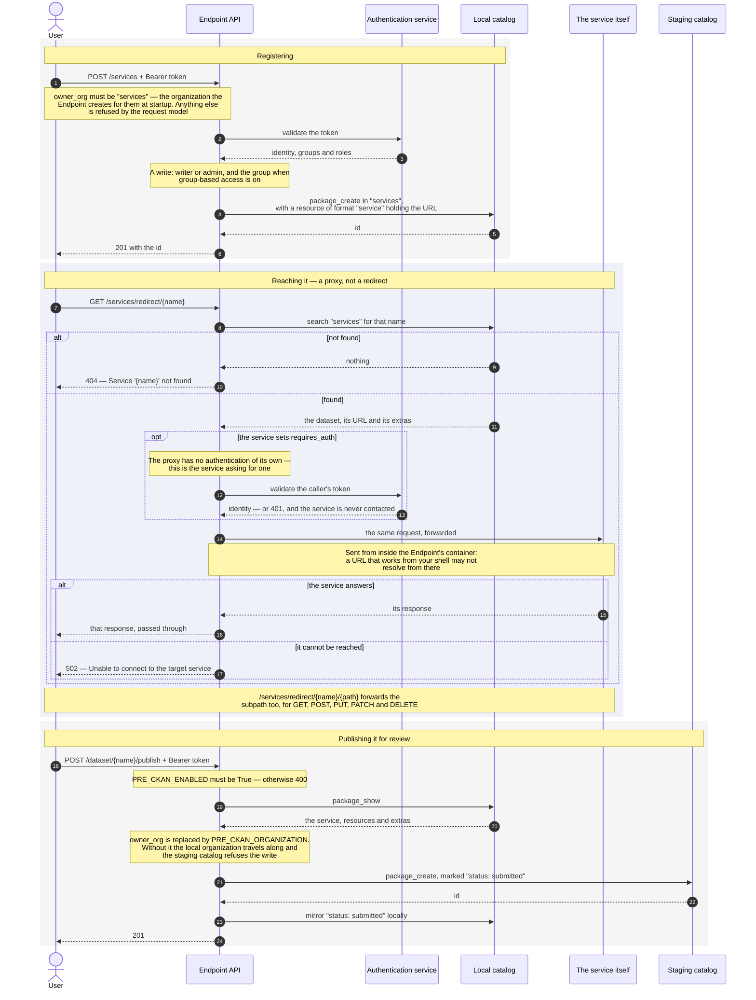

# Registering, reaching and publishing a service

A service is a dataset that points at something running: an API, a UI, a
trigger. Registering one puts it in the Endpoint's catalog; the Endpoint can
then be used to reach it; and promoting it offers it to the platform for
review.

Drawn against an Endpoint with a local catalog and the staging catalog
configured — a registered install with MongoDB or CKAN.

## The sequence



## The three things that catch people out

**`owner_org` must be `services`.** Not the Endpoint's organization, not the
user's. The request model validates it against that exact string, and the
Endpoint creates that organization for itself at startup. Services live
together there, which is also how the redirect finds them.

**The redirect is a proxy.** `/services/redirect/{name}` does not answer 302
and does not send the caller to the service. The Endpoint forwards the request
and returns what comes back, so the caller only ever talks to the Endpoint. Two
consequences worth planning for:

- The request leaves from **inside the Endpoint's container**. A service at
  `http://localhost:8002` — the Endpoint's own published port — is not
  reachable from there, and the answer is `502 Unable to connect to the target
  service`. Register the address the container can resolve.
- The route takes **no token by default**. Whoever can reach the Endpoint
  reaches the service through it. A service that should not be open sets the
  `requires_auth` extra, and the Endpoint then authenticates the caller before
  forwarding anything — see below.

**Publishing needs an organization the staging catalog will accept.** A
promoted dataset keeps its local organization unless `PRE_CKAN_ORGANIZATION`
says otherwise, and `services` is not an organization the staging credentials
own. The failure is an authorization error naming a user, which reads as a
credentials problem:

```
Access denied: User <user> not authorized to add dataset to this organization
```

The installer sets that value from the registration — `ep-<config-id>`, the
organization the Federation minted the staging token for — and checks with the
staging catalog that it is accepted before writing anything. An Endpoint
installed before that, or configured by hand, needs it set.

## Protecting a service

A service is open unless it says otherwise. To have the Endpoint authenticate
callers first, set the `requires_auth` extra when registering it:

```bash
curl -X POST http://localhost:8002/services \
  -H "Authorization: Bearer $TOKEN" -H "Content-Type: application/json" \
  -d '{"service_name":"private-service","service_title":"Private service",
       "owner_org":"services","service_url":"https://example.org/api",
       "service_type":"API","extras":{"requires_auth":"true"}}'
```

From then on the proxy refuses anonymous callers, and the service is never
contacted for them:

```
GET /services/redirect/private-service
401  This service requires authentication. Provide a bearer token.
     WWW-Authenticate: Bearer
```

Subpaths are covered too, so `/services/redirect/private-service/anything` is
not a way around it. `True`, `true`, `1`, `yes` and `on` all mean protected;
anything else, including the extra being absent, means open — so every service
registered before this stays exactly as reachable as it was.

What this checks is that the caller holds a token this Endpoint can validate.
It is authentication, not authorization: it does not ask which groups or roles
the user has. A service that needs finer rules still has to apply them itself,
and it can — the proxy forwards the `Authorization` header, so the token
reaches the service.

That forwarding cuts both ways: whoever registers a service receives the
tokens of everyone who reaches it through the proxy. Registering requires a
writer role, so this is not open to anonymous callers, but it is worth knowing
before pointing a service at somewhere you do not control.

## What it looks like end to end

```bash
# 1. Register
curl -X POST http://localhost:8002/services \
  -H "Authorization: Bearer $TOKEN" -H "Content-Type: application/json" \
  -d '{"service_name":"my-service","service_title":"My service",
       "owner_org":"services","service_url":"https://example.org/api",
       "service_type":"API"}'
# 201 {"id":"0300b047-..."}

# 2. Reach it — no token
curl http://localhost:8002/services/redirect/my-service
# 200, with whatever the service answered

# 3. Publish it for review
curl -X POST http://localhost:8002/dataset/my-service/publish \
  -H "Authorization: Bearer $TOKEN"
# 201 {"id":"86551d66-...","message":"Dataset published to PRE-CKAN successfully"}
```

`service_type` is one of **API**, **UI** or **Trigger**, and the service can
also carry a health-check URL, documentation URL and notes.

## Related

- [Publishing a dataset](publishing-a-dataset.md) — the same promotion, for data
- [Installing an Endpoint registered with the Federation](installing-registered-no-catalog.md) — where the staging credentials come from
- [Roles and permissions](../roles-and-permissions.md) — who may register one
